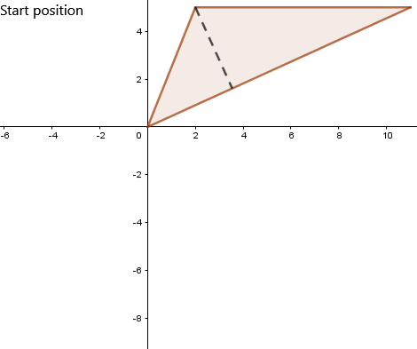
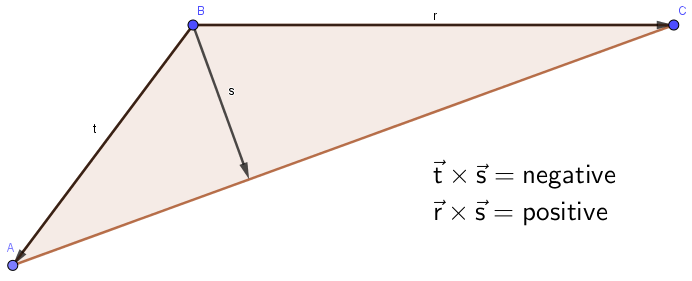
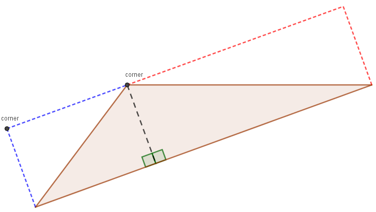
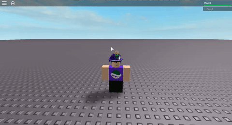

On occasion you may find it necessary to draw triangles given three points in 2D space. This article aims to go over one method that can be used to create those triangles using knowledge of trigonometry and the 2D rotation matrix.

## Table of Contents

* [Triangle decomposition](#triangle-decomposition)
* [Positioning the UI](#positioning-the-ui)
* [Putting it all together](#putting-it-all-together)
* [Positioning the UI Anchor points](#positioning-the-ui-anchor-points)

## Triangle decomposition

The first thing we need to be aware of is that Roblox does not have a singular default shape that can be used to create any 2D triangle. However, using image labels we are able to upload right-angle triangles. Thus, we can decompose any triangle into a maximum of two right-angle triangles and draw from there. We can easily draw this process by placing a perpendicular line on the longest edge and having it intersect with the opposite vertex.


Now that we understand the basics of our goal we have to ask ourselves how we can achieve this mathematically. We'll start this process off by finding some information about the triangle depending on what side is the longest.


```Lua
local function draw2dTriangle(a, b, c, parent)
	local edges = {
		{longest = (c - a), other = (b - a), origin = a},
		{longest = (a - b), other = (c - b), origin = b},
		{longest = (b - c), other = (a - c), origin = c}
	};
	
	local edge = edges[1];
	for i = 2, #edges do
		if (edges[i].longest.magnitude > edge.longest.magnitude) then
			edge = edges[i];
		end
	end
end
```

Now that we have that information we can solve for one of the interior angles using the dot product between the two vectors we singled out. Having this angle allows us to use the basics of trigonometry to solve for our width and height for both of the triangles.


```Lua
local function draw2dTriangle(a, b, c, parent)
	-- code from before...
	local theta = math.acos(edge.longest.unit:Dot(edge.other.unit));
	-- SOHCAHTOA
	local w1 = math.cos(theta) * edge.other.magnitude * edge.longest.unit;
	local w2 = edge.longest - w1;
	local h = math.sin(theta) * edge.other.magnitude;
end
```

Beautiful! We now have the sizes (as magnitudes) of our two right triangles!

The last thing we need to answer before we start to talk about how to actually place the image labels is how to find the overall rotation of the triangle. To do this we need to take note that we're trying to find the rotation from the center of the triangle. We can easily find this if we find the rotation of the line that splits the two right triangles and then subtract 90 degrees.



I think it's worth noting that the above gif implies the vector that splits the triangle is negative. This would not actually be true in our case though unless the triangle was upside down since UDim2 has increasing y-values as you travel down the screen.

```Lua
local function draw2dTriangle(a, b, c, parent)
	-- code from before...
	local r = w1 - edge.other;
	local rotation = math.atan2(r.y, r.x) - math.pi/2;
end
```

Now that we have all the necessary info about our triangle we can start to talk about how to properly display it.

## Positioning the UI

As mentioned at the begining of the article, we use two right angle triangle images to display the triangle. If you look in the images folder you'll notice both [rightTriangle1.png](imgs/rightTriangle1.png) and [rightTriangle2.png](imgs/rightTriangle2.png) which are two white right-angle triangles that have opposing slopes. These are the two triangles we'll be using with our image labels.

What's most important to take away from these triangles is that because of the opposing slopes we cannot arbitarily use either image for the two right triangles we are trying to represent. The solution here is to use the 2d cross product (just the z-value). Using knowledge of the right hand rule we know the sign of the result will tell us the direction of the slope.



*Note the sign of the cross product may be different than what you expect because in UDim2 positive y-values go down on screen, not up*

We will use this value to find the corners that the image label should be placed at (where the top left corner should go). The triangle with the rightward descending slope will always have its corner on the vertex that is opposite to the longest edge. Meanwhile the leftward descending slope will have to be calculated.



```Lua
local function draw2dTriangle(a, b, c, parent)
	-- code from before...
	local nz = -edge.other:Cross(r);
	local tlc1 = edge.origin + edge.other; -- top left corner 1
	local tlc2 = nz < 0 and tlc1 - w1 or tlc1 + w2; -- top left corner 2
end
```

The last thing we need is to adjust the corner positions we just calculated. We have the real position, but Roblox (regardless of rotation) will always place GUI elements as if they aren’t rotated. Since this is the case we have to essentially “de-rotate” our corners and use those.

Since shapes rotate from the center we must first take the corners relative to their centers, then we can use a [2D rotation matrix](https://github.com/EgoMoose/Articles/blob/master/Rodrigues'%20rotation/Rodrigues'%20rotation.md#2d-rotation-matrix) to rotate the corners.

```Lua
local function rotateV2(v, t)
	local c, s = math.cos(t), math.sin(t);
	local x = v.x*c + v.y*s;
	local y = -v.x*s + v.y*c;
	return Vector2.new(x, y);
end

local function draw2dTriangle(a, b, c, parent)
	-- code from before...
	local width2 = tlc1 - tlc2
	local width1 = width2.unit * (edge.longest.magnitude - width2.magnitude);
	
	local center1 = tlc1 + (width1 + r) * 0.5;
	local center2 = tlc2 + (width2 + r) * 0.5;
	local rtlc1 = center1 + rotateV2(tlc1 - center1, rotation);
	local rtlc2 = center2 + rotateV2(tlc2 - center2, rotation);
end
```

You may also notice we can use this opportunity to find the widths of each right angle triangle without having to deal with the cross product value again (although that's an alternative approach).

## Putting it all together

When you put everything together you have a way to position and properly size two image labels to fit any triangle!



```Lua
local img = Instance.new("ImageLabel");
img.BackgroundTransparency = 1;
img.BorderSizePixel = 0;

local function rotateV2(v, t)
	local c, s = math.cos(t), math.sin(t);
	local x = v.x*c + v.y*s;
	local y = -v.x*s + v.y*c;
	return Vector2.new(x, y);
end

local function draw2dTriangle(a, b, c, parent)
	local edges = {
		{longest = (c - a), other = (b - a), origin = a},
		{longest = (a - b), other = (c - b), origin = b},
		{longest = (b - c), other = (a - c), origin = c}
	};
	
	local edge = edges[1];
	for i = 2, #edges do
		if (edges[i].longest.magnitude > edge.longest.magnitude) then
			edge = edges[i];
		end
	end
	
	local theta = math.acos(edge.longest.unit:Dot(edge.other.unit));
	local w1 = math.cos(theta) * edge.other.magnitude * edge.longest.unit;
	local w2 = edge.longest - w1;
	local h = math.sin(theta) * edge.other.magnitude;
	
	local r = w1 - edge.other;
	local rotation = math.atan2(r.y, r.x) - math.pi/2;
	
	local nz = -edge.other:Cross(r);
	local tlc1 = edge.origin + edge.other;
	local tlc2 = nz < 0 and tlc1 - w1 or tlc1 + w2;
	
	local width2 = tlc1 - tlc2
	local width1 = width2.unit * (edge.longest.magnitude - width2.magnitude);
	
	local center1 = tlc1 + (width1 + r) * 0.5;
	local center2 = tlc2 + (width2 + r) * 0.5;
	local rtlc1 = center1 + rotateV2(tlc1 - center1, rotation);
	local rtlc2 = center2 + rotateV2(tlc2 - center2, rotation);
	
	local rightward = img:Clone();
	rightward.Image = "rbxassetid://319692171";
	rightward.Position = UDim2.new(0, rtlc1.x, 0, rtlc1.y);
	rightward.Size = UDim2.new(0, width1.magnitude, 0, h);
	rightward.Rotation = math.deg(rotation);
	rightward.Parent = parent;
	
	local leftward = img:Clone();
	leftward.Image = "rbxassetid://319692151";
	leftward.Position = UDim2.new(0, rtlc2.x, 0, rtlc2.y);
	leftward.Size =  UDim2.new(0, width2.magnitude, 0, h);
	leftward.Rotation = math.deg(rotation);
	leftward.Parent = parent;
end
```

## Positioning the UI: Anchor points

When this article was originally written the [AnchorPoint](https://wiki.roblox.com/index.php?title=API:Class/GuiObject/AnchorPoint) property did not exist. If we set the anchor point to the center of the image label this makes properly positioning the image labels infintely easier. Now we no longer need to use the 2D rotation matrix to adjust the corners, we just have to calculate the center

Thus, we can update our code accordingly!

```Lua
local img = Instance.new("ImageLabel");
img.BackgroundTransparency = 1;
img.AnchorPoint = Vector2.new(0.5, 0.5);
img.BorderSizePixel = 0;

local function draw2dTriangle(a, b, c, parent)
	local edges = {
		{longest = (c - a), other = (b - a), origin = a},
		{longest = (a - b), other = (c - b), origin = b},
		{longest = (b - c), other = (a - c), origin = c}
	};
	
	local edge = edges[1];
	for i = 2, #edges do
		if (edges[i].longest.magnitude > edge.longest.magnitude) then
			edge = edges[i];
		end
	end
	
	local theta = math.acos(edge.longest.unit:Dot(edge.other.unit));
	local w1 = math.cos(theta) * edge.other.magnitude * edge.longest.unit;
	local w2 = edge.longest - w1;
	local h = math.sin(theta) * edge.other.magnitude;
	
	local r = w1 - edge.other;
	local rotation = math.atan2(r.y, r.x) - math.pi/2;
	
	local nz = -edge.other:Cross(r);
	local tlc1 = edge.origin + edge.other;
	local tlc2 = nz < 0 and tlc1 - w1 or tlc1 + w2;
	
	local width2 = tlc1 - tlc2
	local width1 = width2.unit * (edge.longest.magnitude - width2.magnitude);
	
	local center1 = tlc1 + (width1 + r) * 0.5;
	local center2 = tlc2 + (width2 + r) * 0.5;
	
	local rightward = img:Clone();
	rightward.Image = "rbxassetid://319692171";
	rightward.Position = UDim2.new(0, center1.x, 0, center1.y);
	rightward.Size = UDim2.new(0, width1.magnitude, 0, h);
	rightward.Rotation = math.deg(rotation);
	rightward.Parent = parent;
	
	local leftward = img:Clone();
	leftward.Image = "rbxassetid://319692151";
	leftward.Position = UDim2.new(0, center2.x, 0, center2.y);
	leftward.Size =  UDim2.new(0, width2.magnitude, 0, h);
	leftward.Rotation = math.deg(rotation);
	leftward.Parent = parent;
end
```
