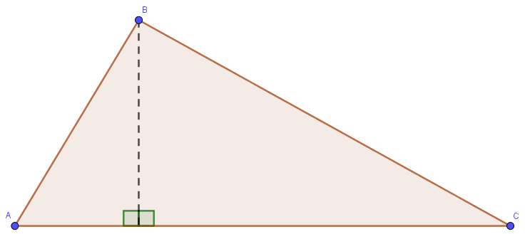
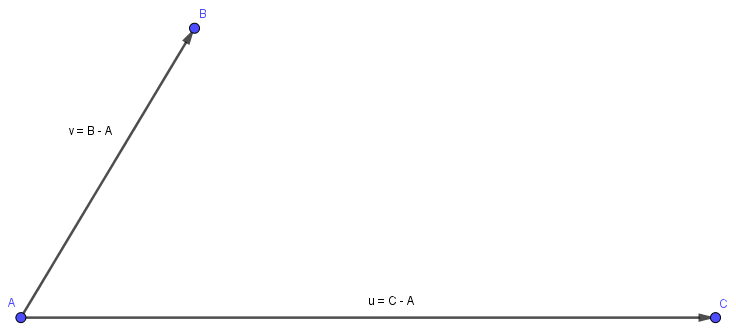
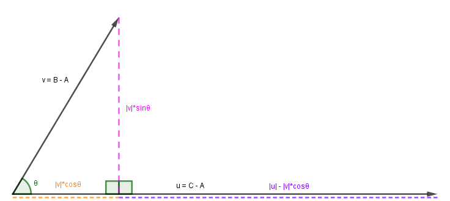
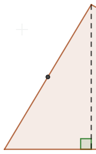
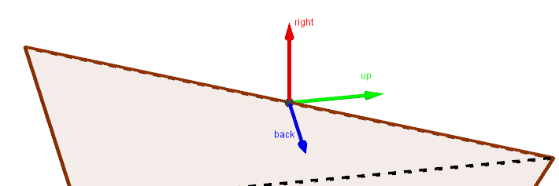
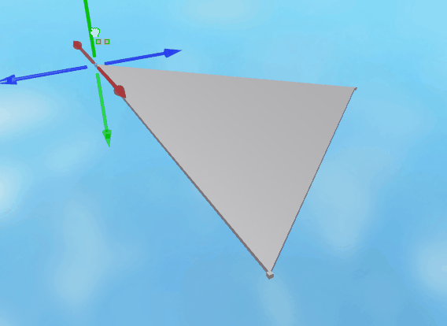
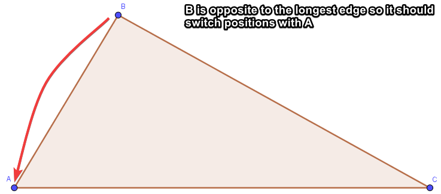

# 3D Triangles

On occasion, you may find it necessary to draw triangles with three given points in 3D space. This article aims to go over one method that can be used to create those triangles using knowledge of trigonometry and coordinate frames.

## Table of contents

* [Triangle decomposition](#triangle-decomposition)
* [Manipulating the rotation matrix](#manipulating-the-rotation-matrix)
* [Optimization](#optimization)

## Triangle decomposition

The first thing we need to be aware of is that Roblox does not have a singular default shape that can be used to create any 3D triangle. However, a shape that Roblox does have is right-angle triangles, otherwise known as wedges. Thus, we can decompose any triangle into a maximum of two right-angle triangles and draw from there. We can easily draw this process by placing a perpendicular line on the longest edge and having it intersect with the opposite vertex.



Now that we understand the basics of our goal, we have to ask ourselves how this can be achieved mathematically. We'll start this process off by finding some information about the triangle, depending on which side is the longest.



```Lua
local function draw3dTriangle(a, b, c, parent)
	local edges = {
		{longest = (c - a), other = (b - a), origin = a},
		{longest = (a - b), other = (c - b), origin = b},
		{longest = (b - c), other = (a - c), origin = c}
	};
	
	local edge = edges[1];
	for i = 2, #edges do
		if (edges[i].longest.magnitude > edge.longest.magnitude) then
			edge = edges[i];
		end
	end
end
```

Now that we have that information, we can solve one of the interior angles using the dot product between the two vectors we singled out. Having these angles allows us to use the basics of trigonometry to solve for our width and height for both of the triangles.



```Lua
local function draw3dTriangle(a, b, c, parent)
	-- code from before...
	local theta = math.acos(edge.longest.unit:Dot(edge.other.unit));
	-- SOHCAHTOA
	local w1 = math.cos(theta) * edge.other.magnitude;
	local w2 = edge.longest.magnitude - w1;
	local h = math.sin(theta) * edge.other.magnitude;
end
```

Beautiful! We now have the sizes of our two right triangles. Now we have to answer how we can properly position and rotate two wedges so they represent the larger triangle they are part of.

## Manipulating the rotation matrix

When using CFrames, rarely do we find ourselves in a situation where we manually enter rotation components. This is one of those situations! We know a CFrame's rotation matrix represents the right, up, and back-facing directions in any given rotation. If we can find out what those vectors are for each wedge, we can plug them in to create a CFrame!

```Lua
local cf = CFrame.new() * CFrame.Angles(math.pi/4, math.pi/3, 0);
local x, y, z, r11, r12, r13, r21, r22, r23, r31, r32, r33 = cf:components();
 
local position = Vector3.new(x, y, z);
local right = Vector3.new(r11, r21, r31); -- right facing direction
local up = Vector3.new(r12, r22, r32); -- up facing direction
local back = Vector3.new(r13, r23, r33); -- back facing direction
 
print(cf.lookVector, -back); -- lookVector's the front facing direction so -back == cf.lookVector
```

However, before we even talk about how we’re going to get the right, up, and back vectors, let’s first talk about how we’re going to get the position, which is pretty straightforward with some simple vector math. Even though a wedge isn’t a rectangle, it’s still positioned as such. That means the position we want for each wedge is the mid-way point across each right triangle’s hypotenuse.



```Lua
local function draw3dTriangle(a, b, c, parent)
	-- code from before...
	local p1 = edge.origin + edge.other * 0.5;
	local p2 = edge.origin + edge.longest + (edge.other - edge.longest) * 0.5;
end
```

Now that we have both positions, we can focus entirely on getting the facing directions for the rotation matrix. We can get the `right` vector of the rotation matrix by crossing the `longest` vector with the `other` vector and then normalizing. Once we have the `right` vector, we can cross it with the `longest` vector and normalize again to get the `up` vector. Finally, the `back` vector is simply just the longest vector normalized.



```Lua
local function draw3dTriangle(a, b, c, parent)
	-- code from before...
	local right = edge.longest:Cross(edge.other).unit;
	local up = right:Cross(edge.longest).unit;
	local back = edge.longest.unit;
end
```

Finally, we just have to plug these directions into the two wedges’s CFrames, remembering to take into account that because their hypotenuses are sloping away from each other, some of the rotational vectors are flipped.

```Lua
local function draw3dTriangle(a, b, c, parent)
	-- code from before...
	local cf1 = CFrame.new( -- wedge1 cframe
		p1.x, p1.y, p1.z,
		-right.x, up.x, back.x,
		-right.y, up.y, back.y,
		-right.z, up.z, back.z
	);
 
	local cf2 = CFrame.new( -- wedge2 cframe
		p2.x, p2.y, p2.z,
		right.x, up.x, -back.x,
		right.y, up.y, -back.y,
		right.z, up.z, -back.z
	);
end
```

When you put everything together, you have a way to position and properly size two wedges to fit into any triangle!



```Lua
local wedge = Instance.new("WedgePart");
wedge.Anchored = true;
wedge.TopSurface = Enum.SurfaceType.Smooth;
wedge.BottomSurface = Enum.SurfaceType.Smooth;

local function draw3dTriangle(a, b, c, parent)
	local edges = {
		{longest = (c - a), other = (b - a), origin = a},
		{longest = (a - b), other = (c - b), origin = b},
		{longest = (b - c), other = (a - c), origin = c}
	};
	
	local edge = edges[1];
	for i = 2, #edges do
		if (edges[i].longest.magnitude > edge.longest.magnitude) then
			edge = edges[i];
		end
	end
	
	local theta = math.acos(edge.longest.unit:Dot(edge.other.unit));
	local w1 = math.cos(theta) * edge.other.magnitude;
	local w2 = edge.longest.magnitude - w1;
	local h = math.sin(theta) * edge.other.magnitude;
	
	local p1 = edge.origin + edge.other * 0.5;
	local p2 = edge.origin + edge.longest + (edge.other - edge.longest) * 0.5;
	
	local right = edge.longest:Cross(edge.other).unit;
	local up = right:Cross(edge.longest).unit;
	local back = edge.longest.unit;
	
	local cf1 = CFrame.new(
		p1.x, p1.y, p1.z,
		-right.x, up.x, back.x,
		-right.y, up.y, back.y,
		-right.z, up.z, back.z
	);
 
	local cf2 = CFrame.new(
		p2.x, p2.y, p2.z,
		right.x, up.x, -back.x,
		right.y, up.y, -back.y,
		right.z, up.z, -back.z
	);
	
	-- put it all together by creating the wedges
	
	local wedge1 = wedge:Clone();
	wedge1.Size = Vector3.new(0.2, h, w1);
	wedge1.CFrame = cf1;
	wedge1.Parent = parent;
	
	local wedge2 = wedge:Clone();
	wedge2.Size = Vector3.new(0.2, h, w2);
	wedge2.CFrame = cf2;
	wedge2.Parent = parent;
end
```

## Optimization

The above code is fine, but there's a lot we can do to make our triangle calculation much more efficient. We will mainly do this by removing any trigonometric functions we can.

So when starting a new function, the first thing we want to do is adjust our points so that point a is the point that is not connected to the longest edge.



```Lua
local function draw3dTriangle(a, b, c, parent, w1, w2)
	local ab, ac, bc = b - a, c - a, c - b;
	local abd, acd, bcd = ab:Dot(ab), ac:Dot(ac), bc:Dot(bc);
	
	if (abd > acd and abd > bcd) then
		c, a = a, c;
	elseif (acd > bcd and acd > abd) then
		a, b = b, a;
	end
	
	ab, ac, bc = b - a, c - a, c - b;
end
```

Now we are certain the longest edge is `bc` and the two shorter edges are `ab` and `ac`. We can use this information to find the right, up, and back vectors again.

```Lua
local function draw3dTriangle(a, b, c, parent, w1, w2)
	-- code from before...
	local right = ac:Cross(ab).unit;
	local up = bc:Cross(right).unit;
	local back = bc.unit;
end
```

Once again, using the fact that the geometric definition of the dot product is `a.b = |a||b|cosθ` we can do some vector projections and find the width and height of each triangle.

```Lua
local function draw3dTriangle(a, b, c, parent, w1, w2)
	-- code from before...
	local height = math.abs(ab:Dot(up));
	
	w1 = w1 or wedge:Clone();
	w1.Size = Vector3.new(0, height, math.abs(ab:Dot(back)));
	
	w2 = w2 or wedge:Clone();
	w2.Size = Vector3.new(0, height, math.abs(ac:Dot(back)));
end
```

Finally, we can create the CFrame by using the three directional vectors from earlier and the mid point of the two short edges. We could put each component in manually like before, but alternatively we can use the constructor `CFrame.fromMatrix` which will take the vectors and do it for us.

Putting everything together, we get our final optimized function:

```Lua
local wedge = Instance.new("WedgePart");
wedge.Anchored = true;
wedge.TopSurface = Enum.SurfaceType.Smooth;
wedge.BottomSurface = Enum.SurfaceType.Smooth;

local function draw3dTriangle(a, b, c, parent, w1, w2)
	local ab, ac, bc = b - a, c - a, c - b;
	local abd, acd, bcd = ab:Dot(ab), ac:Dot(ac), bc:Dot(bc);
	
	if (abd > acd and abd > bcd) then
		c, a = a, c;
	elseif (acd > bcd and acd > abd) then
		a, b = b, a;
	end
	
	ab, ac, bc = b - a, c - a, c - b;
	
	local right = ac:Cross(ab).unit;
	local up = bc:Cross(right).unit;
	local back = bc.unit;
	
	local height = math.abs(ab:Dot(up));
	
	w1 = w1 or wedge:Clone();
	w1.Size = Vector3.new(0, height, math.abs(ab:Dot(back)));
	w1.CFrame = CFrame.fromMatrix((a + b)/2, right, up, back);
	w1.Parent = parent;
	
	w2 = w2 or edge:Clone();
	w2.Size = Vector3.new(0, height, math.abs(ac:Dot(back)));
	w2.CFrame = CFrame.fromMatrix((a + c)/2, -right, up, -back);
	w2.Parent = parent;
	
	return w1, w2;
end
```

