So I wanted to make this post to share a few niche, but useful CFrame tricks along with examples. 

Be forewarned I'm going to start talking about Quaternions so if you're not versed in that you'll probably want to [read up on that.](https://github.com/EgoMoose/Articles/blob/master/Quaternions/Rotation%20quaternions%20and%20slerping.md)

## Rotation between two vectors CFrame

The first thing I want to talk about is calculating a CFrame that represents the shortest rotational path between two vectors. So given two unit vectors `u` and `v` can we calculate a CFrame that gives us the shortest rotational path between the two?

In other words a CFrame that would fulfill the following:

```Lua
getRotationBetween(u, v) * u == v
```

Well first let's see how we can deal with this problem without quaternions. There are three cases we have to watch out for:

1. When the `u` and `v` vectors are the same i.e. `u == v`, then we know the shortest rotational path is no rotation at all!

2. If the `u` and `v` are complete opposites i.e. `u == -v`, then we choose an arbitrary axis and rotate by 180 degrees.

3. When `u` and `v` are different, but not complete opposites we use the [cross product](https://github.com/EgoMoose/Articles/blob/master/Vectors/Cross%20product.md) to get the axis of rotation and the [dot product](https://github.com/EgoMoose/Articles/blob/master/Vectors/Dot%20product.md) to get the angle of rotation. We can then plug these into the CFrame.fromAxisAngle constructor to get the rotation between the two vectors as a CFrame.

Putting this into code:

```Lua
local function getRotationBetween(u, v, axis)
    local dot = u:Dot(v)
    if (dot > 0.99999) then
        -- situation 1
        return CFrame.new()
    elseif (dot < -0.99999) then
        -- situation 2
        return CFrame.fromAxisAngle(axis, math.pi)
    end
    -- situation 3
    return CFrame.fromAxisAngle(u:Cross(v), math.acos(dot))
end
```

Now this is fine and all, but there's a more elegant solution (in my opinion at least) with quaternions.

We know that we could convert an axis angle rotation to a quaternion by doing the following:

```Lua
theta = math.acos(u:Dot(v))
axis = u:Cross(v).Unit

qw = math.cos(theta / 2)
qx = math.sin(theta / 2) * axis.x
qy = math.sin(theta / 2) * axis.y
qz = math.sin(theta / 2) * axis.z
```

We also know that due to the magnitudes of the cross and dot product that:

```Lua
u:Dot(v) = |u|*|v|*cos(theta) = cos(theta)
u:Cross(v).x = |u|*|v|*sin(theta) * axis.x = sin(theta) * axis.x
u:Cross(v).y = |u|*|v|*sin(theta) * axis.y = sin(theta) * axis.y
u:Cross(v).z = |u|*|v|*sin(theta) * axis.z = sin(theta) * axis.z
```

So you'll note then that if I just went ahead and plugged the dot and cross products into the quaternion constructor I'd get a rotation that represents double the rotation along the correct axis! So the question becomes, is there a way to half this rotation amount? Yes, there are a couple. 

A lazy way would be to (s)lerp half-way:

```Lua
local function getRotationBetween(u, v, axis)
    local dot, uxv = u:Dot(v), u:Cross(v)
    return CFrame.new():Lerp(CFrame.new(0, 0, 0, uxv.x, uxv.y, uxv.z, dot), 0.5)
end
```

A more efficient way would be to recognize that since we're dealing with a unit quaternion which is a point on a 4D hypersphere we can just add our quaternion to the un-rotated state and normalize. This might be somewhat hard to visualize in 4D so let's use an image of a 3D sphere to hopefully get the message across.

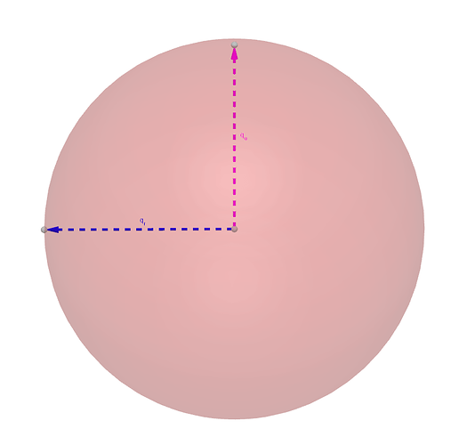 

In this case `q_r` is our double rotation quaternion and `q_u` is an unrotated quaternion. If we add them together we get quaternion `w`.

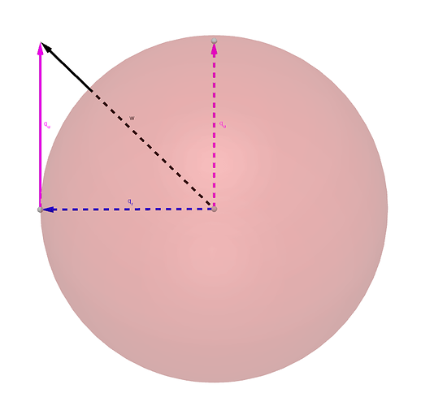 

This isn't a unit quaternion however so we have to normalize it to `w_n`.

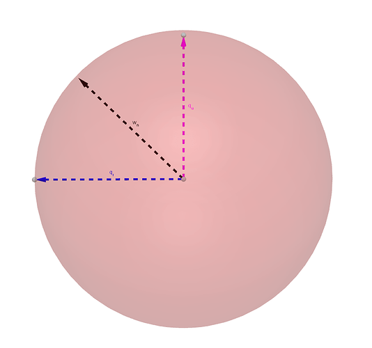

So taking into account then that our double rotated quaternion can be represented as `q_r = [u:Dot(v), u:Cross(v)]` and the unrotated quaternion as `q_u = [1, Vector3.new(0, 0, 0)]` then adding them together we get: `q_r + q_u = [1 + u:Dot(v), u:Cross(v)]`. We can just plug this in directly to the CFrame quaternion constructor as it will normalize the result for us.

Now one thing to note about an edge case that we weren't able to catch with the lerp method. Say that `u == -v`. In that case our added quaternion is: `q_r + q_u = [0, Vector3.new(0, 0, 0)]`. Of course this can't be normalized so we don't have a valid rotation when there's a 180 degree difference. As a result we'll need to again bring over a backup axis.

```Lua
local function getRotationBetween(u, v, axis)
    local dot, uxv = u:Dot(v), u:Cross(v)
    if (dot < -0.99999) then return CFrame.fromAxisAngle(axis, math.pi) end
    return CFrame.new(0, 0, 0, uxv.x, uxv.y, uxv.z, 1 + dot)
end
```

Well there we have it, a function to get the CFrame rotation between two vectors. So what's it useful for?

Arguably one of the more straight forward uses is that it provides a really quick and robust way to slerp unit vectors.

```Lua
local rotation = getRotationBetween(u, v, axis)

for i = 0, 1.01, 0.01 do
    local v = CFrame.new():Lerp(rotation, i) * u
end
```
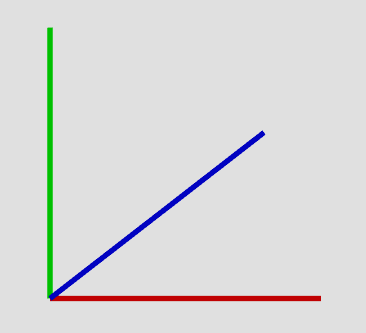

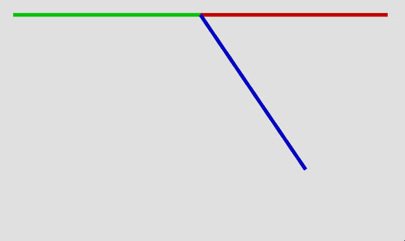 

Another neat use for this I actually discovered while talking to @Quenty. This function comes in handy when you're trying to find a surface CFrame aligned with the surface edges.

The idea is as follows:

1. Pick a static surface normal that you'll be able to use for any part.

2. Find the rotation between that universal surface normal and the arbitrary one you supply. Take note that we can also pick a static axis vector to rotate around given the 180 degree case since we know the value of the universal surface normal.

3. Multiply this rotation against part's CFrame.

4. Rotate this by some constant (if you wish) such that the axes running parellel to the surface are to your preference.

So in my case I chose to use `Vector3.new(0, 1, 0)` as the universal normal and as such I picked `Vector3.new(0, 0, 1)` as the axis b/c I know it's orthogonal to the universal normal.

```Lua
-- makes it so the RightVector and UpVector run parellel to the surface and LookVector = surface normal
local EXTRASPIN = CFrame.fromEulerAnglesXYZ(math.pi/2, 0, 0)

local function getSurfaceCF(part, lnormal)
    local transition = getRotationBetween(Vector3.new(0, 1, 0), lnormal, Vector3.new(0,0, 1))
    return part.CFrame * transition * EXTRASPIN
end
```

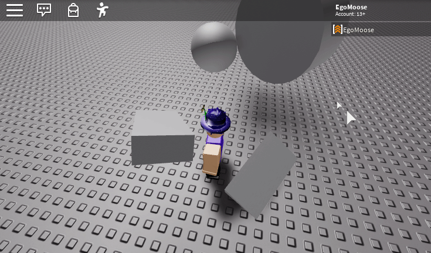 

Another example of this function is again using the slerp functionality to transition smoothly to a custom camera up vector. You can read about that [here.](https://devforum.roblox.com/t/release-custom-character-controller/172696/117?u=egomoose)

## Swing-Twist decomposition

Now for a new question. Is it possible to find the spin around an arbitrary axis?

Say we have some rotation. We know that any rotation can be written as a combination of some arbitrary rotation and some amount of twisting. Commonly this is called a swing-twist decomposition.

```
rotation = swing * twist
```

So the question is can we some how decompose a CFrame to find the `swing` and `twist` values given we pick an arbitrary `twist` axis?

Well there's a couple approaches we can come at this from. We can use our function from above to find the amount we swing from our twist axis to the end rotation and then use the inverse to solve for the twist.

```Lua
local function swingTwist(cf, direction)
	local swing = CFrame.new()
	local rDirection = cf:VectorToWorldSpace(direction)
    if (rDirection:Dot(direction) > -0.99999) then
        -- we don't need to provide a backup axis b/c it will nvr be used
		swing = getRotationBetween(direction, rDirection, nil)
	end
	-- cf = swing * twist, thus...
	local twist = swing:Inverse() * cf
	return swing, twist
end
```

This is alright, but it's dependent on the `getRotationBetween` function we found earlier. That's fine, but ideally we could have these functions be independent. Luckily we can figure out a more elegant solution by looking at the composition as quaternions.

We want to solve for `qs` and `qt` which when multiplied together give us our final rotation `q`. We know the components of `q` and we know the direction of the twist axis `d`.

In summary:

```Lua
q = [w, v]
qs = [ws, vs]
qt = [wt, vt]

q = qs * qt

d = unit twist axis
```

By definition we know a few results of using the dot product so let's write them out for later use:

```Lua
vs . vt = 0 -- the twist and swing axis are orthogonal by definition
vs . d = 0 -- d is the same direction as vt thus by same logic as above these are orthogonal
vt . d = |vt||d|*cos(0) = |vt| -- since d and vt go in same direction angle between them is 0
vs:Cross(vt) . d = 0 -- vt and d are in same direction thus the cross and d must be orthogonal
```

Now if we use the quaternion rules of multiplication and simplify what we can with the above:

```Lua
q = qs * qt = [ws*wt - vt.vs, ws*vt + wt*vs + vs:Cross(vt)]
            = [ws*wt, ws*vt + wt*vs + vs:Cross(vt)]

Thus,
w = ws*wt
v = ws*vt + wt*vs + vs:Cross(vt)
```

Now if we dot `v` with `d` we get:

```Lua
v . d = (ws*vt + wt*vs + vs:Cross(vt)) . d
      = ws*(vt . d) + wt*(vs . d) + (vs:Cross(vt)) . d)
      = ws*(vt . d)
```

Now if we divide w by `v . d` plus `w` we get:

```Lua
w / (w + (v . d)) = ws*wt / (ws*wt + ws*(vt . d))
                  = wt / (wt + (vt . d))
                  = wt / (wt + |vt|)
```

It might seem like we're stuck here, but recall unit quaternions (which is what qt and qs are) have magnitudes of 1. Thus, `wt + |vt| = 1`. As a result then it must be that:

```Lua
wt = w / (w + (v . d))
```

From here finding the rest of `qt` is easy given you know how quaternions work. 

```Lua
ws = w / wt = w / (w / (w + (v . d))) = w + (v . d)
(v . d)*d / ws = (ws*(vt . d)*d) /  ws = (vt . d)*d = vt

vt = (v . d)*d / w + (v . d)
```

We could go through that math, but it's much faster to simply plug into the CFrame quaternion constructor which will do most of the work for us.

```Lua
local function swingTwist(cf, direction)
    local axis, theta = cf:ToAxisAngle()
    -- convert to quaternion
    local w, v = math.cos(theta/2),  math.sin(theta/2)*axis

    -- (v . d)*d, plug into CFrame quaternion constructor with w it will solve rest for us
	local proj = v:Dot(direction)*direction
    local twist = CFrame.new(0, 0, 0, proj.x, proj.y, proj.z, w)
    
    -- cf = swing * twist, thus...
	local swing = cf * twist:Inverse()
	
	return swing, twist
end
```

Now, it's important to note that by the nature of converting a quaternion to an axis angle, the rotation angle will be always be positive and it's the axis that will flip.

This may not be ideal depending on what you're trying to do, but it's an easy fix. We just check the sign of the dot product of the input direction against the end rotation's axis.

```Lua
local function twistAngle(cf, direction)
    local axis, theta = cf:ToAxisAngle()
    local w, v = math.cos(theta/2),  math.sin(theta/2)*axis
	local proj = v:Dot(direction)*direction
    local twist = CFrame.new(0, 0, 0, proj.x, proj.y, proj.z, w)
    local nAxis, nTheta = twist:ToAxisAngle()
    return math.sign(v:Dot(direction))*select(2, twist:ToAxisAngle())
end
```

Okay, so why is this useful?

Well, so far I've mostly found use in the twist aspect of the decomposition. It allows me to find out how much a CFrame has spun around an arbitrary axis. This is useful for things such as matching the camera's rotation to a spinning part you're standing on.

For instance, in the custom camera up place which I linked above we can add:

```Lua
CameraModule.LastSpinPart = game.Workspace.Terrain
CameraModule.SpinPartPrevCF = CFrame.new()
CameraModule.SpinCFrame = CFrame.new()
CameraModule.SumDelta = 0

-- update this method elsewhere to get the part we're standing on for example
function CameraModule:GetSpinPart()
	return game.Workspace.Terrain
end

function CameraModule:CalculateSpin()
	local spinPart = self:GetSpinPart()
	local rCF = spinPart.CFrame - spinPart.CFrame.p
	local prCF = self.SpinPartPrevCF - self.SpinPartPrevCF.p
	
    local direction = rCF:VectorToObjectSpace(self.UpVector)
    
    -- get the angular difference between current and last rotation around the camera up axis
    -- multiply by sign of y in case camera is upside down
    local delta = twistAngle(prCF:Inverse() * rCF, direction) * math.sign(self.UpVector.y)
    
    -- if we switch part we're standing on then we shouldn't rotate this frame
	if (spinPart ~= self.LastSpinPart) then
		delta = 0
	end

	self.SumDelta = self.SumDelta + delta
	self.SpinCFrame = CFrame.Angles(0, self.SumDelta, 0)
	self.SpinPartPrevCF = spinPart.CFrame
	self.LastSpinPart = spinPart
end

function CameraModule:Update(dt)
	if self.activeCameraController then
		local newCameraCFrame, newCameraFocus = self.activeCameraController:Update(dt)
		self.activeCameraController:ApplyVRTransform()

		self:CalculateRotationCFrame() -- used for custom up vector
		self:CalculateSpin()
		
		local offset = newCameraFocus:Inverse() * newCameraCFrame
        newCameraCFrame = newCameraFocus * self.SpinCFrame * self.RotationCFrame * offset
        -- rest of stuff from custom up place...
```

As I mentioned above, if you update the `:GetSpinPart()` method to what the character is standing on you get a result like so.

 

When most people attempt to do this type of thing they base it on the part's delta CFrame as opposed to the delta angle. This can cause issues with things that wobble, but you'll note if you test yourself that our solution solves that! :grin:

Another useful thing we can use this decomposition for is finding the center of rotation around an axis based purely off a delta CFrame.

[CustomCamera.rbxl](other/advancedTricks/CustomCamera.rbxl)

Say we have a spinning platform like so:

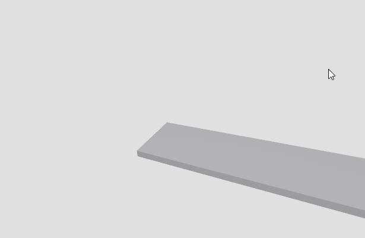 

We know the center of rotation is where the motor is, but finding it out with code is a whole different story.

Normally we are trying to solve for `P` in this image given we know `cfA` and `cfB`:

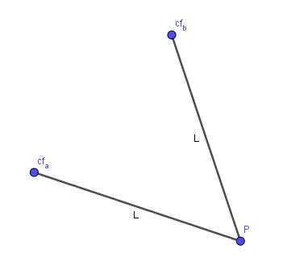 

Normally we can't get very far because that's not enough information to solve for `P` or `L`. However, since we can get the delta angle around an axis we actually have one more piece of info that makes solving this possible.

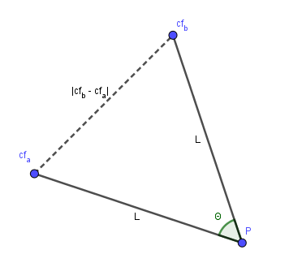 

Now, with theta, solving is as simple as using the law of cosines and noting that the two angles at cfA and cfB must be the same.

```Lua
local function findCenterOfRotation(cfA, cfB, axis)
	local cf = cfB:Inverse() * cfA
	local theta = twist(cf, axis)
	local v = cfA.p - cfB.p
	
	local vdot = v:Dot(v)
	local alpha = (math.pi - theta)/2
	local length = vdot > 0 and math.sqrt(0.5 * vdot / (1 - math.cos(theta))) or 0
    
	-- rotate v around axis by alpha, normalize, and set new length as L
	local point = vdot > 0 and cfB.p + (CFrame.fromAxisAngle(axis, alpha) * v).unit * length or cfA.p
	
	return point
end
```

Applying this to our original spinning platform:

```Lua
local lastSpinCF = spin.CFrame

game:GetService("RunService").Heartbeat:Connect(function(dt)
	local point = findCenterOfRotation(spin.CFrame, lastSpinCF, AXIS)
	center.CFrame = CFrame.new(point)
	lastSpinCF = spin.CFrame
end)
```

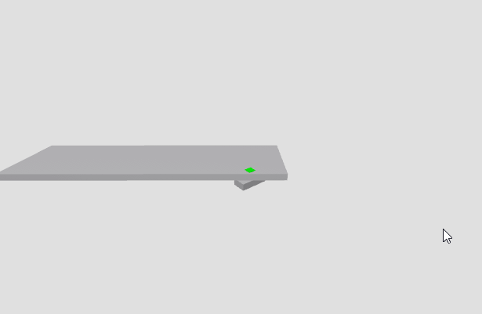 

[CenterOfRotation.rbxl](other/advancedTricks/CenterOfRotation.rbxl)

Well, those are two very specific, but advanced CFrame tricks. Hope they end up helping you out in some way as you dev.

Enjoy!

---

## Edit 1

Question:
> I can’t understand much of this. But thanks for the great tricks. I’m barely starting out scripting myself and haven’t gotten to C-Frames yet.
Can you elaborate exactly how this would work in a short sentence?
It’d be appreciated, but you don’t have to.

I don't know about a short sentence. I'd say my attempt at a quick explanation was in the original post. However, I can take another run at explaining the output of these functions.

I think I can give a bit more insight into the swing-twist decomposition, but I don't know if I can give any better example/explanation of the `getRotationBetween` function. Anyways, for now:

Say I have a block:

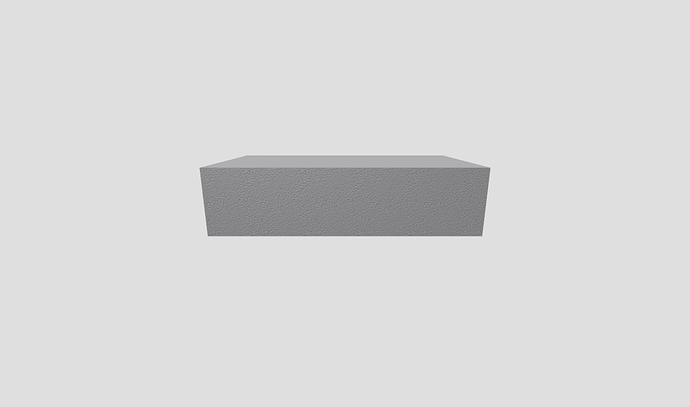 

Now I rotate the block in some crazy weird way:

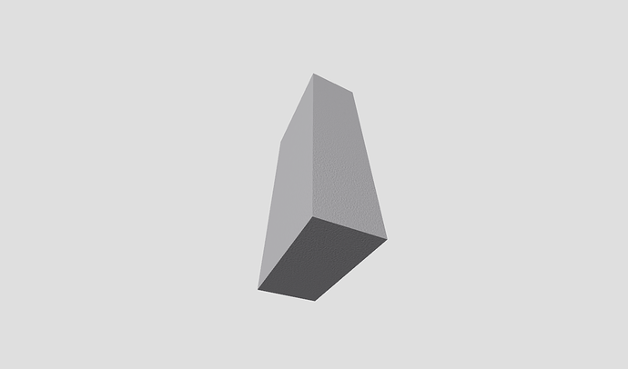 

Now I'm picking an arbitrary vector which I want to know how much of the rotation twists around . In the gif below I represent this vector (direction) with the bright green line.

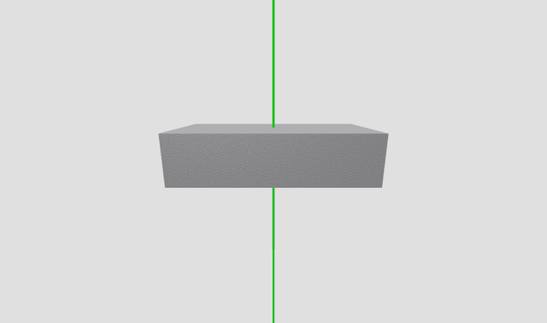 

That's not a very easy question to answer is it? Regardless we solved it above so if we use the function we can get two CFrames; one for the twist and the the other for the rest (swing). When I combine them together I still get the same end result, but some times it can be useful to have them separate.

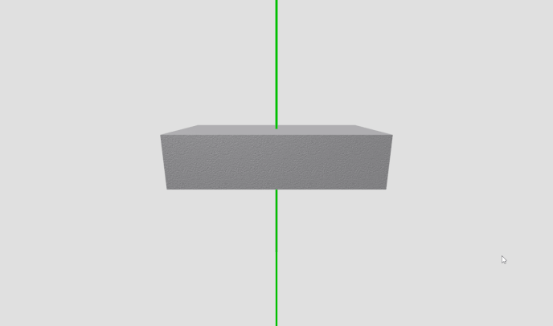 

You can see in the above gif we first do the swing rotation, there's a slight pause, then we do the twist. This gets us to the final end result CFrame.

## Edit 2

Another neat trick I just thought of recently (although Idk if it'd qualify as "advanced")

We all know and love the `CFrame.fromEulerAnglesXYZ` and `CFrame.fromEulerAnglesYXZ` constructors, but that's only a few of many ways to apply rotation axis order. We can write a function that will apply rotations in any order given we write it out.

```Lua
local function fromEulerAngles(order, ...)
	local cf = CFrame.new()
	for i = 1, #order do
		local axis = Vector3.FromAxis(Enum.Axis[string.sub(order, i, i)])
		cf = cf * CFrame.fromAxisAngle(axis, select(i, ...))
	end
	return cf
end
```

Now we can do stuff like:

```Lua
fromEulerAngles("XXY", math.pi, -math.pi, math.pi/2)
fromEulerAngles("YXY", math.pi, -math.pi, -math.pi)
fromEulerAngles("YYYYZ", 1, 1, 1, 1, 1)
-- etc, etc...
```

The function is useful enough on it's own but we could use metatables and a module to make the whole thing play nice with the standard CFrame function library.

```Lua
-- in a module script

local cframe = {}

local function fromEulerAngles(order, ...)
	local cf = CFrame.new()
	for i = 1, #order do
		local axis = Vector3.FromAxis(Enum.Axis[string.sub(order, i, i)])
		cf = cf * CFrame.fromAxisAngle(axis, select(i, ...))
	end
	return cf
end

setmetatable(cframe, {
	__index = function(t, k)
		if (CFrame[k]) then 
			return CFrame[k]
		elseif (type(k) == "string" and string.sub(k, 1, 15) == "fromEulerAngles") then
			local order = string.sub(k, 16)
			local func = function(...) return fromEulerAngles(order, ...) end
			cframe[k] = func
			return func
		end
	end
})

return cframe

-- in some other script

local CFrame = require(the_above_module)
print(CFrame.fromEulerAnglesXXY(math.pi, -math.pi, math.pi/2))
```

Again, hope that helps! Enjoy!

## Edit 3

Another quick thing I should mention about swing twist:

In the OP I talked about solving for `q = qs * qt`, so swing then twist. However, if you tried to solve for `q = qt * qs` you'd get the exact same results we got above. Surely this doesn't make sense? That would imply that `q = qs * qt = qt * qs`, right?

Well, no... What you'd be forgetting to take into account is that due to `qt` being pre-multiplied our input direction vector must be object space relative to the axis-aligned identity CFrame whereas before it was object space to the end result CFrame.

```Lua
-- where cfB is the end result CFrame
-- swing twist our direction vector is object space to the end CFrame
local swing, twist = swingTwist(cfB, cfB:VectorToObjectSpace(line.CFrame.UpVector))

-- twist swing our direction vector is object space to CFrame.new()
local function twistSwing(cf, direction)
	local axis, theta = cf:ToAxisAngle()
	local w, v = math.cos(theta/2),  math.sin(theta/2)*axis
	local proj = v:Dot(direction)*direction
	local twist = CFrame.new(cf.x, cf.y, cf.z, proj.x, proj.y, proj.z, w)
	local swing = twist:Inverse() * cf
	return swing, twist
end

local swing, twist = twistSwing(cfB, line.CFrame.UpVector)
``` 

