# CFrame inversion

**This article was written for [ScriptingHelpers](https://scriptinghelpers.org/blog/community-question-solving-system-of-equations-with-cframes).**

Today I recieved the following message from a user:

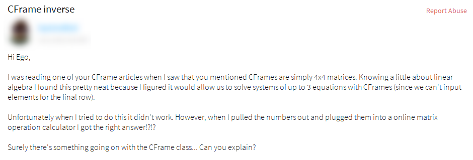

This user is correct! There is something going on with the CFrame class that is making his calculation not work that's no fault of his own. In this blog post blog post we'll explore why that is.

## Solving a system of equations with a matrix

Before we get into the why, let's recreate what the user was having difficulties with so we're all on the same page.

Say we have a time-based parabola with three unknowns.

`f(t) = a*t^2 + b*t + c`

We can provide 3 contraints on this parabola to find out what the 3 unknowns are. The three constraints we will use are 3 t-values that correspond to a certain output the function should give.

`f(t0) = a*t0^2 + b*t0 + c = y0`

`f(t1) = a*t1^2 + b*t1 + c = y1`

`f(t2) = a*t2^2 + b*t2 + c = y2`

We can put this into a 4x4 matrix (although we only need a 3x3) since CFrames are 4x4 matrices.

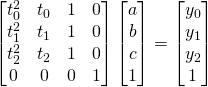

Note that the only matrix we don't know all the values in is the one with `a`, `b`, and `c`. Thus, if we use matrix inversion we can solve for the unknown matrix with `a`, `b`, and `c` in it.

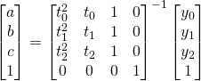

Now what the user in the message is trying to take advantage of is that CFrames fill in 4x4 matrices in the following form:

```Lua
CFrame.new(x, y, z, m11, m12, m13, m21, m22, m23, m31, m32, m33)
```


And vectors like so:

```Lua
Vector3.new(x, y, z)
```

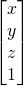

So by plugging our values into the proper Vector3 and CFrame components we can then use the `:inverse()` method to solve for `a`, `b`, and `c`.

```Lua
local t0, t1, t2 = 0, 1, 2;
local y0, y1, y2 = 0, 10, 0;

local cf = CFrame.new(0, 0, 0, t0^2, t0, 1, t1^2, t1, 1, t2^2, t2, 1);
local v = Vector3.new(y0, y1, y2);

print(cf:inverse() * v); 
-- a, b, c -> 10, 10, 10 WRONG!!!
```

Sure enough these values are incorrect. If we go to an online matrix opperation calculator we will get a [completely different answer.](https://www.symbolab.com/solver/matrix-calculator/%5Cbegin%7Bpmatrix%7D0%260%261%260%5C%5C%201%261%261%260%5C%5C%204%262%261%260%5C%5C%200%260%260%261%5Cend%7Bpmatrix%7D%5E%7B-1%7D%5Cbegin%7Bpmatrix%7D0%5C%5C%2010%5C%5C%200%5C%5C%201%5Cend%7Bpmatrix%7D)

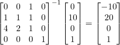

## Why don't CFrames work?

Now we can start to discuss why using CFrames gives the wrong answer. The reason has to do with a concious decision the programmers made when creating the CFrame class. Instead of using a standard technique for inverting the matrix they decided to take advantage of the fact that a CFrame's rotational aspect **should** be orthonormal.

What do I mean by orthonormal? An orthonormal matrix is when the column vectors that make up the matrix are all unit vectors (have magnitude of 1) and are exactly 90 degrees apart from one another. Unless you're purposefully inputting illegal components into the CFrame like we have done above, then a CFrame will always be orthonormal.

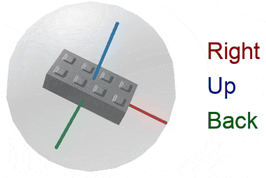
*Note the column vectors are 90 degrees apart and all unit vectors*

So say we have an orthonormal 3x3 matrix (the rotational aspect of a CFrame).

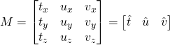

We can transpose this matrix to get the following:

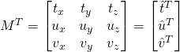

If we multiply the transpose against the original matrix we'll notice something interesting.

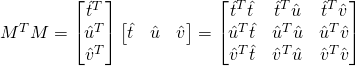

Multiplying a transposed vector against a non-transposed vector of the same size gives the dot product:

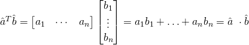

Since all vectors have a magnitude of that means the dot product geometric form simplifies to:

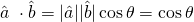

We know of course that since all the vectors are orthogonal to each other that there's a 90 degree difference between two spererate vectors and a 0 degree difference between two of the same vector. Since `cos(90) = 0` and `cos(0) = 1` we can fill in the end result matrix:

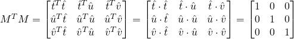

We're left with the identity matrix!

Therefore, by the uniqueness of the inverse matrix it must be that:

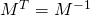

Sure enough if you compare with an online matrix inversion tool you'll see that the CFrame class is simply transposing, not actually inverting.

Actual inverse:

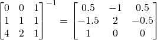

CFrame inverse method (transpose):

```Lua
local t0, t1, t2 = 0, 1, 2;
local y0, y1, y2 = 0, 10, 0;

local cf = CFrame.new(0, 0, 0, t0^2, t0, 1, t1^2, t1, 1, t2^2, t2, 1);

print(cf:inverse())
--[[ -0, -0, -0, 0, 1, 4, 0, 1, 2, 1, 1, 1
3x3 rotation aspect:
0, 1, 4, 
0, 1, 2, 
1, 1, 1
--]]

-- transpose manually
print(CFrame.new(0, 0, 0, t0^2, t1^2, t2^2, t0, t1, t2, 1, 1, 1));
--[[ 0, 0, 0, 0, 1, 4, 0, 1, 2, 1, 1, 1
3x3 rotation aspect:
0, 1, 4, 
0, 1, 2, 
1, 1, 1
--]]
```

Of course the actual inverse and the transpose are the same when the matrix is orthonormal.

Actual inverse:

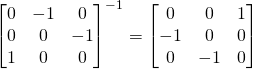

CFrame inverse method (transpose):

```Lua
local cf = CFrame.new(0, 0, 0, 0, -1, 0, 0, 0, -1, 1, 0, 0)
print(cf:inverse())
--[[ -0, 0, 0, 0, 0, 1, -1, 0, 0, 0, -1, 0
3x3 rotation aspect:
0, 0, 1, 
-1, 0, 0, 
0, -1, 0
--]]
```

## A quick note on position

So far our focus has been on the 3x3 rotational aspect of the 4x4, but what about the position? Our new position values will be the negative of the position vector multiplied against the transposed 3x3. To see why it's best to just show the math.

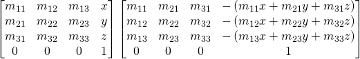

Once again we can refer to the columns as vectors again where position is represented by the `p` vector. If we multiply to find just the last column (position) we get:

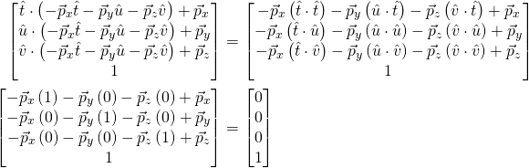

Sure enough when we multiply a CFrame against it's own inverse the position should be `0, 0, 0` so we know we've done it right!

## Conclusion

So after all that we've shown that CFrames don't calculate their inverses quite like you might expect. That being said using the transpose is a lot faster and easier to program so it makes sense. The moral of the story is you probably shouldn't use CFrames to calculate systems of equations unless your system ends up being orthonormal which is very unlikely.

As a side note, this was a great question! If any readers ever have any questions they think would make a good blog post feel free to send them to me.

Anyways, thanks for reading!