> This guide was originally written for [scriptinghelpers ](https://scriptinghelpers.org/). The original can be found [here ](https://scriptinghelpers.org/blog/creating-a-furniture-placement-system).

One of the most common requests I get for blog post topics are for a decoration placement system that saves. I’ve shied away from this topic in the past as there is no singular “correct” way to do it. That being said, I think it's a good exercise for all game devs to go through and will potentially place a role in a future blog post I plan to write.

In addition to change things up, I’ll also take the time to explain and use Object Oriented Programming (OOP) as it’s not only my own preferred style, but also something Roblox uses for their core scripts.

## Object Oriented Programming

OOP is all about writing classes which in this context is a very fancy synonym for the word “blueprint”. We can then use these blueprints to create objects that have certain properties and methods.

If some of these words sound familiar to you, well, that’s because they are. The objects that you interact with such as `Parts`, `Humanoids`, `Motor6Ds`, and so forth are by design of the OOP paradigm. These objects have properties and methods that when combined define how they interact with our game.

Properties are used to define “characteristics” of an object. For example, a `Part` has a property called `Size` which as its name suggests defines how large or small the object is. In turn these properties often play a role in the behaviour and actions associated with said object which is defined by methods. For instance, the method `:GetMass()` returns the mass of the part which among other things varies with size. Thus, we can see an example of a clear connection here between methods and properties.

Now that we have some of the terminology down and an example I’d like to further discuss the distinction between classes and objects. A class defines the properties and methods that an object will have. For example, we know all parts are going to have a position property, so we define it in our class. The actual value of the position property will vary between individual objects, but the overarching concept of a part we know will have a property called `Position` with a `Vector3` as its value. In a similar sense when writing the methods of our class we may not know the literal values for each property, but since we know that those values will exist, we can treat them almost like function parameters.

The difference between OOP and a more functional approach for the same task can be seen in the code sample below.

```Lua
local part = Instance.new("Part")
part.Size = Vector3.new(1, 2, 10)
part.Material = Enum.Material.Wood

print(part:GetMass()) -- 6.9999998807907

-- vs:

local function getMass(size, material)
	-- mass = volume * density
	local volume = size.x * size.y * size.z
	local density = PhysicalProperties.new(material).Density
	return volume * density
end

print(getMass(part.Size, part.Material)) -- 6.9999998807907
```

Ignoring that fact that the method is built-in and thus didn’t have to be defined, the only difference was that in the functional approach we had to plug in the part’s properties as arguments manually. In the method’s case we didn’t have to plug in any arguments because Lua knew we were calling a method on a specific object and thus could grab the properties needed directly from it. A method is just the name we give to functions that are applied to a specific object. An example of what this might look like would be this:

```Lua
function Part:GetMass()
	local volume = self.Size.x * self.Size.y * self.Size.z
	local density = PhysicalProperties.new(self.Material).Density
	return volume * density
end
```

You might note that the above code is referencing something called `self` and understandably this seems like it’s coming out of thin air. In Lua, when you call a method the first argument passed is ALWAYS the object the method was called on. When defining a method with the syntax form `function Class:MyMethod(param1, param2, …)` the parameter that will represent the object is forcibly given the name `self` and shouldn’t be defined in the brackets like any other extra parameters. So, if I ran `somePart:GetMass()` then the argument that would replace `self` would be `somePart`.

As a side note, either due to personal preference or a familiarity with other languages that use another keyword other than `self` such as `this`, some programmers may wonder if there’s a way to use a different parameter name. This is possible, and the equivalent code would be the following:

```Lua
-- the self argument is still passed, but it's parameter name is no longer hidden and can be changed
function Part.GetMass(self)
	local volume = self.Size.x * self.Size.y * self.Size.z
	local density = PhysicalProperties.new(self.Material).Density
	return volume * density
end

-- still called like a normal method
print(somePart:GetMass())
```

It would be my personal recommendation however that you do not do this as it can be confusing to others from a readability perspective.

Alright, so how do we write a class? The last piece of the puzzle is something called a constructor. A constructor creates an object from the class and returns it back to us with a set of filled in properties. A very common constructor that I think (?) all of the built-in classes have is `.new()` but other examples might be `Vector3.FromNormalId` or `CFrame.Angles`. A class can have multiple constructors and they can be named just about anything. Sometimes when we write these constructors, they have parameters that help us fill in properties and other times they don’t. It’s completely up to you as the programmer and dependent on what the class if for.

Let’s look at how the staff at Roblox might write a constructor in Lua and we’ll break down the parts from there. Here’s an example of how one might copy the `Vector3` class constructor.

```Lua
local Vector3 = {}
Vector3.__index = Vector3

-- constructor

function Vector3.new(x, y, z)
	local self = setmetatable({}, Vector3)
	
	self.x = x or 0
	self.y = y or 0
	self.z = z or 0
	
	return self
end
```

To some of you this might already make perfect sense and to some of you it may not. The key difference between those who understand and those who do not should be familiarity with metatables. This is a big topic in of itself, but luckily, we only really need to understand one aspect of the `__index` metamethod to understand this code.

The best “dumbed down” explanation I’ve heard of meta-tables is “events, but for tables” and this is particularly applicable to the `__index` metamethod. The `__index` metamethod is “fired” when an non-existing key in a the table is indexed meaning read, not written.

```Lua
local t = {
    cats = 10;
    dogs = 32;
}

local cats = t.cats -- not fired b/c value exists for key
local dogs = t.dogs -- not fired b/c value exists for key
t.turtles = 60 -- not fired b/c we are writing
print(t.hamsters) -- fired b/c value does not exist for key
```

Now typically metamethods will "fire" a function and the `__index` metamethod can also work in this way. However, if instead of setting a function to the `__index` metamethod you set another table then when the `__index` metamethod is “fired” it treats the process as such:

> * __Table was indexed with key => Does the key correspond with a nil value in the table?__
>	* __Yes__ => Does the key correspond with a non-nil value in the table in the __index metamethod?
>		* __Yes__ => Return that value
>		* __No__ => Return nil

This is quite useful to us at it allows us to set default values to keys and not have to constantly redefine and repeat ourselves when making copies. In the case of the above code we use this such that `self`, the table we return from our constructor, will have access to all the constructors and methods we attach to the `Vector3` table.

Say we add the following method to the above code then create an object and run the method on it:

```Lua
function Vector3:Magnitude()
	local x, y, z = self.x, self.y, self.z
	return math.sqrt(x*x + y*y + z*z)
end

local v = Vector3.new(1, 2, 3)
print(v:Magnitude())
```

The process is treated as such:

> * __v was indexed with Magnitude key => Does the key correspond to a nil value in v?__
>	* __Yes__ => Does the key correspond with a non-nil value in Vector3?
>		* __Yes__ => Return that value (the magnitude method)

Thus the `:Magnitude()` method is called on `v` which has actual values for properties `x, y, and z` and as such we get the corresponding result.
	
There’s a lot more to be said about OOP and what I have explained has barely scratched the surface. Some other languages force you to use OOP and have a much richer set of features compared to Lua. If you want to further explore OOP in Lua I recommend you read the [following post on the devforums](https://devforum.roblox.com/t/all-about-object-oriented-programming/8585).

All that being said, the question I still have not answered is “Why use OOP?”. My answer: I personally enjoy it as it forces me to organize my code in a modular and reusable way that can be combined together for a variety of complex tasks. That being said there's positives and negatives for everything so use what works for you.

## Grid placement

Finally we can get into the purpose of this blog post! Before we even start about specifics let's layout a few things we want our placement system to do.

* Constrain objects for placement on a flat surface
* Filtering enabled friendly
* Save any placements we make so they are there when we rejoin the game

In this section we'll mainly be focusing on the flat surface constraining part, but we'll also want to take into account filtering enabled for some of this. As such our first step is going to be talking about that.

Now I don't know about you guys, but personally when I write FE friendly stuff I don't like to repeat myself. Unfortunately that's a rabbit hole that we can easily fall down. So the way I approach FE with OOP is to use the `RunService:IsServer()` method. This tells me if my code is being run on the server or on the client. If I bake that into my own class then when I run things I'll be able to have both logic for client and server specific things. The only catch here is that I actually need two identical objects created by the class. One on the server, and another on the client. I'll henceforth refer to these as twins.

For the sake of this post here's how I might setup the server handing and the class constructor.

```Lua
-- Server Script

-- the module script from below
local placementClass = require(game:GetService("ReplicatedStorage"):WaitForChild("Placement"))
local placementObjects = {}

local remotes = game:GetService("ReplicatedStorage"):WaitForChild("Remotes")

-- creates the server twin, stores in a table and returns the CanvasObjects property
function remotes.InitPlacement.OnServerInvoke(player, canvasPart)
	placementObjects[player] = placementClass.new(canvasPart)
	return placementObjects[player].CanvasObjects
end

-- finds the server twin and calls a method on it
-- note: b/c we aren't using the standard method syntax we must manually put in the self argument
remotes.InvokePlacement.OnServerEvent:Connect(function(player, func, ...)
	if (placementObjects[player]) then
		placementClass[func](placementObjects[player], ...)
	end
end)

-- Class (Module Script)

local isServer = game:GetService("RunService"):IsServer()

local Placement = {}
Placement.__index = Placement

function Placement.new(canvasPart)
	local self = setmetatable({}, Placement)

	-- the part we are placing models on
	self.CanvasPart = canvasPart
	
	-- custom logic depending on if the sevrer or not
	if (isServer) then
		-- create a folder we'll place the objects in
		self.CanvasObjects = Instance.new("Folder")
		self.CanvasObjects.Name = "CanvasObjects"
		self.CanvasObjects.Parent = canvasPart
	else
		-- initiate the twin on the server
		self.CanvasObjects = initPlacement:InvokeServer(canvasPart)
	end
	
	-- we'll talk about these properties later in the post
	self.Surface = Enum.NormalId.Top
	self.GridUnit = 1

	return self
end

return Placement
```

Moving onto methods, we'll probably want at least two (we can always add more later). The first method, `:CalcCanvas()` will tell us the surface's CFrame (rotation and center) and size (width and height). The `:CalcPlacementCFrame()` method will be used to find the `model` parameter's constrained CFrame that is closest to the `position` parameter. The `rotation` pameter will allow us to adjust for when we wish to rotate our model by 90 degree increments.

```Lua
-- methods

function Placement:CalcCanvas()
	-- use to find the boundaries and CFrame we need to place object
	-- on a surface
end

function Placement:CalcPlacementCFrame(model, position, rotation)
	-- use to find to find the constrained CFrame of the model 
	-- for placement
end
```

Let's start filling these out shall we?

```Lua
function Placement:CalcCanvas()
	local canvasSize = self.CanvasPart.Size

	-- want to create CFrame such that cf.lookVector == self.CanvasPart.CFrame.upVector
	-- do this by using object space and build the CFrame
	local back = Vector3.new(0, -1, 0)
	local top = Vector3.new(0, 0, -1)
	local right = Vector3.new(-1, 0, 0)

	-- convert to world space
	local cf = self.CanvasPart.CFrame * CFrame.fromMatrix(-back*canvasSize/2, right, top, back)
	-- use object space vectors to find the width and height
	local size = Vector2.new((canvasSize * right).magnitude, (canvasSize * top).magnitude)

	return cf, size
end
```

Sure enough, if we try this out and draw out the CFrame in some way we'll see that it matches the rotation, it's placed in the center of the surface, and the `lookVector` is equivalent to the top-surface's normal.

```Lua
local test = Placement.new(game.Workspace.ExampleCanvas)
local cf, size = test:CalcCanvas()

print(cf, size)
print(cf.lookVector == game.Workspace.ExampleCanvas.CFrame.upVector) -- true
```

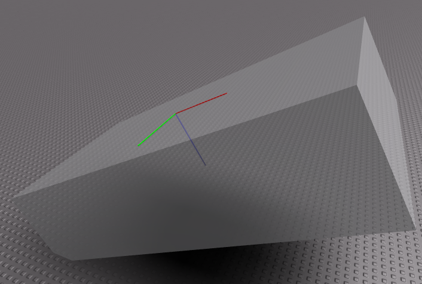 

Now before moving onto the `:CalcPlacementCFrame()` method let's discuss a few assumptions we can make about the models we place. The biggest of these assumptions is that they will have a primary part which represents their bounding box. This part will likely be completely transparent and non-collidable, but those choices are up to you as the developer.

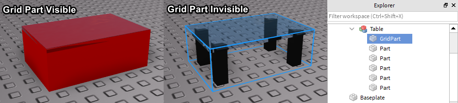 

Now that we have that out of the way let's fill in the method.

```Lua
function Placement:CalcPlacementCFrame(model, position, rotation)
	-- use other method to get info about the surface
	local cf, size = self:CalcCanvas()

	-- rotate the size so that we can properly constrain to the surface
	local modelSize = CFrame.fromEulerAnglesYXZ(0, rotation, 0) * model.PrimaryPart.Size
	modelSize = Vector3.new(math.abs(modelSize.x), math.abs(modelSize.y), math.abs(modelSize.z))

	-- get the position relative to the surface's CFrame
	local lpos = cf:pointToObjectSpace(position);
	-- the max bounds the model can be from the surface's center
	local size2 = (size - Vector2.new(modelSize.x, modelSize.z))/2

	-- constrain the position using size2
	local x = math.clamp(lpos.x, -size2.x, size2.x);
	local y = math.clamp(lpos.y, -size2.y, size2.y);

	-- create and return the CFrame
	return cf * CFrame.new(x, y, -modelSize.y/2) * CFrame.Angles(-math.pi/2, rotation, 0)
end
```

Now we have a basic working surface placement method. Let's try testing it out.

```Lua
local canvas = game.Workspace.ExampleCanvas
local furniture = game.ReplicatedStorage.Furniture

-- create an object with the constructor
local placement = Placement.new(canvas)

local mouse = game.Players.LocalPlayer:GetMouse()
mouse.TargetFilter = placement.CanvasObjects

local tableModel = furniture.Table:Clone()
tableModel.Parent = mouse.TargetFilter

local rotation = 0

local function onRotate(actionName, userInputState, input)
	if (userInputState == Enum.UserInputState.Begin) then
		rotation = rotation + math.pi/2
	end
end

game:GetService("ContextActionService"):BindAction("rotate", onRotate, false, Enum.KeyCode.R)

game:GetService("RunService").RenderStepped:Connect(function(dt)
	local cf = placement:CalcPlacementCFrame(tableModel, mouse.Hit.p, rotation)
	tableModel:SetPrimaryPartCFrame(cf)
end)
```

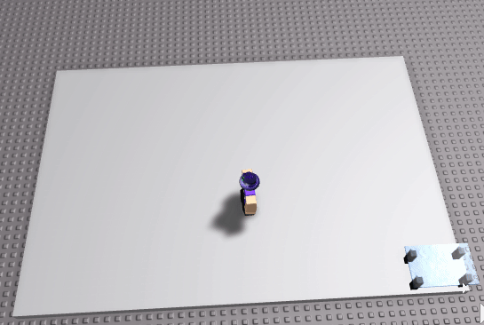 

Everything looks good, but sometimes we might want to be locked to a grid. To do this we return to our `:CalcPlacementCFrame()` method and round the `x` and `y` variables to the nearest grid value.

```Lua
function Placement:CalcPlacementCFrame(model, position, rotation)
	-- one of the properties I didn't explain earlier
	local g = self.GridUnit
	if (g > 0) then
		x = math.sign(x)*((math.abs(x) - math.abs(x) % g) + (size2.x % g))
		y = math.sign(y)*((math.abs(y) - math.abs(y) % g) + (size2.y % g))
	end
end
```

Now say we set `GridUnit` to `2` then our placement system will be locked to a 2x2 grid!

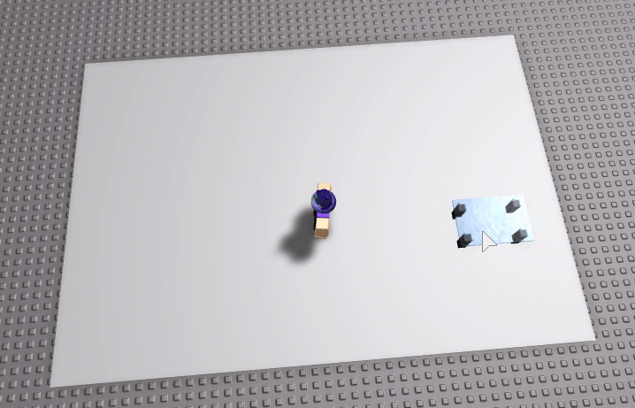 

## Placing the object

Right, so in my opinion getting objects to snap and constrain to a surface is the hardest part, but there's still a few other things we have to do before our placement system is complete.

The main thing we have still yet to cover is finalizing the object's position and then locking it there. This is quite easy in our current form as all we have all the information, but we need to make sure we do the placement on the server. We'll do this with a new method called `:Place()` which will fire a remote event to place the objects.

```Lua
-- new method

function Placement:Place(model, cf)
	if (isServer) then
		local clone = model:Clone()
		clone:SetPrimaryPartCFrame(cf)
		clone.Parent = self.CanvasObjects
	end

	if (not isServer) then
		invokePlacement:FireServer("Place", model, cf)
	end
end

-- put it into action

local function onPlace(actionName, userInputState, input)
	if (userInputState == Enum.UserInputState.Begin) then
		local cf = placement:CalcPlacementCFrame(tableModel, mouse.Hit.p, rotation)
		placement:Place(furniture[tableModel.Name], cf)
	end
end

game:GetService("ContextActionService"):BindAction("place", onPlace, false, Enum.UserInputType.MouseButton1)
```

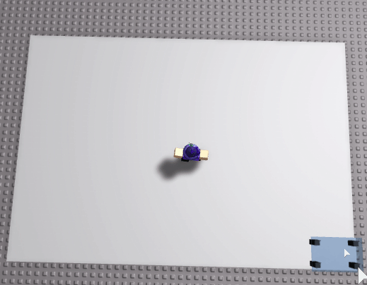 

You'll hopefully notice from the above gif that everything looks pretty good with the exception that we can currently overlap objects. The way we will deal with this is by creating a method that checks if we can validly place the object down and then passing that into our `:Place()` method.

```Lua
function Placement:isColliding(model)
	local isColliding = false

	-- must have a touch interest for the :GetTouchingParts() method to work
	local touch = model.PrimaryPart.Touched:Connect(function() end)
	local touching = model.PrimaryPart:GetTouchingParts()
	
	-- if intersecting with something that isn't part of the model then can't place
	for i = 1, #touching do
		if (not touching[i]:IsDescendantOf(model)) then
			isColliding = true
			break
		end
	end

	-- cleanup and return
	touch:Disconnect()
	return isColliding
end

function Placement:Place(model, cf, isColliding)
	if (not isColliding and isServer) then
		local clone = model:Clone()
		clone:SetPrimaryPartCFrame(cf)
		clone.Parent = self.CanvasObjects
	end

	if (not isServer) then
		invokePlacement:FireServer("Place", model, cf, isColliding)
	end
end
```

Awesome we don't have to worry about that overlap problem anymore!

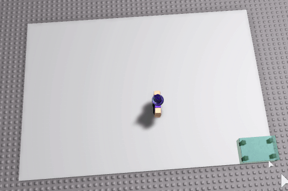 

## Advanced: Using surfaces other than the top

This is a minor addition and can be completely skipped, but for those who are interested about how we might use the other surfaces of a cube aside from the top this section is for you. Just keep in mind that all this can be just as easily achieved if you rotate the canvas part such that it's top surface is facing where you want.

To do this we return to our `:CalcCanvas()` method. Before we used fixed object space vectors to represent the top surface CFrame. If we wanted to have this work for other surface we go through a similar process, but we need to do some actual calculations. We'll now use the property `Surface` which will be a `NormalId` enum to represent the normal of the surface we want to calculate the CFrame for.

```Lua
function Placement:CalcCanvas()
	local canvasSize = self.CanvasPart.Size

	local up = Vector3.new(0, 1, 0)
	local back = -Vector3.FromNormalId(self.Surface)

	-- if we are using the top or bottom then we treat right as up
	local dot = back:Dot(Vector3.new(0, 1, 0))
	local axis = (math.abs(dot) == 1) and Vector3.new(-dot, 0, 0) or up
	
	-- rotate around the axis by 90 degrees to get right vector
	local right = CFrame.fromAxisAngle(axis, math.pi/2) * back
	-- use the cross product to find the final vector
	local top = back:Cross(right).unit

	-- convert to world space
	local cf = self.CanvasPart.CFrame * CFrame.fromMatrix(-back*canvasSize/2, right, top, back)
	-- use object space vectors to find the width and height
	local size = Vector2.new((canvasSize * right).magnitude, (canvasSize * top).magnitude)

	return cf, size
end
```

Here's that in action using the left surface instead of the top.

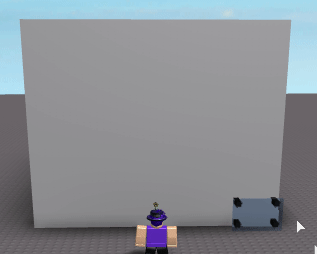 

## Using datastore to save placements

You may find that depending on your game you might want the player to be able to leave and come back to their canvas part with all the stuff they placed on it. To do this we are going to take advantage of datastores.

To start off we need another remote function since the datastore only works on the server. We shouldn't need to pass any data to the server aside from if we should save, clear, or load the data. This is because we already have a twin on the server that has the exact same information.

```Lua
-- Server Script

local datastore = game:GetService("DataStoreService"):GetDataStore("PlacementSystem")

function remotes.DSPlacement.OnServerInvoke(player, saving, useData)
	local key = "player_"..player.UserId
	
	local success, result = pcall(function()
		if (saving and placementObjects[player]) then
			if (useData) then
				-- save the data
				-- :Serialize() is a method we'll talk about in a second
				datastore:SetAsync(key, placementObjects[player]:Serialize())
			else
				-- clear the data
				datastore:SetAsync(key, {})
			end
		elseif (not saving) then
			-- load the data
			return datastore:GetAsync(key)
		end
	end)
	
	if (success) then
		-- return true if we had success or the loaded data
		return saving or result
	else
		-- show us the error if something went wrong
		warn(result)
	end
end
```

Next, as alluded to in the code above we are going to define a new method called `:Serialize()`. This method will convert all the objects we have currently placed into a format that can be stored in a datastore. Since I just want to give a simple example we'll do this by creating a dictionary where an object space CFrame is the key and the furniture item's name is the value.

```Lua
function Placement:Serialize()
	local serial = {}
	
	local cfi = self.CanvasPart.CFrame:inverse()
	local children = self.CanvasObjects:GetChildren()
	
	-- key = object space cframe string
	-- value = object name
	for i = 1, #children do
		local objectSpaceCF = cfi * children[i].PrimaryPart.CFrame
		serial[tostring(objectSpaceCF)] = children[i].Name 
	end
	
	return serial
end
```

Now whenever we are ready to save we can store the return of the `:Serialize()` method to the server and retrieve it later.

The next question we have to answer is how to use that information to put everything back where it was. To do this we will create another constructor. It will take not only a canvas part as an argument, but also retrieved serialized data.

```Lua
function Placement.fromSerialization(canvasPart, data)
	local self = Placement.new(canvasPart)
	local canvasCF = canvasPart.CFrame

	-- if data is nil or empty then this constructor is the same as .new()
	data = data or {}
	
	for cf, name in pairs(data) do
		-- find the furniture model with the same name
		local model = furniture:FindFirstChild(name)
		if (model) then
			-- convert the string CFrame to a real CFrame
			local components = {}
			for num in string.gmatch(cf, "[^%s,]+") do
				components[#components+1] = tonumber(num)
			end
			
			-- place the object
			self:Place(model, canvasCF * CFrame.new(unpack(components)), false)
		end
	end
	
	return self
end
```

Sure enough if we make sure to save and load our data we get the following result:

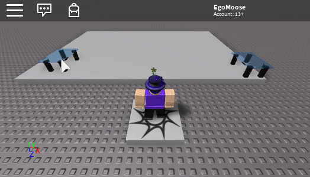 

## Conclusion

That was quite the exercise and there was a lot to learn, but hopefully you are walking away from this with more info in your noggin than before. If you want to see the place in action then check out [this link.](https://www.roblox.com/games/2599366629/Placement-System-SH)

That's all for now folks, hopefully I'll have another post soon!

## Edit 1

> I received a question regarding why placing objects may not go to the direct center of the mouse. I answered this question along with some other useful information.

Good question! The reason it's not centered is because it's locking to a grid. If you want the item to line up directly to the mouse then set the `GridUnit` equal to `0`.

Another behavior you might notice is that anything that isn't a 90 degree increment may not be properly bound to the surface. This is because the code assumes axis aligned rotation and does some simpler math because of it. To fix this you must adjust how the model size is calculated (as a world space bounding box).

```Lua
local function worldBoundingBox(cf, size)
	local size2 = size/2;
	
	local c1 = cf:VectorToWorldSpace(Vector3.new(size2.x, size2.y, size2.z))
	local c2 = cf:VectorToWorldSpace(Vector3.new(-size2.x, size2.y, size2.z))
	local c3 = cf:VectorToWorldSpace(Vector3.new(-size2.x, -size2.y, size2.z))
	local c4 = cf:VectorToWorldSpace(Vector3.new(-size2.x, -size2.y, -size2.z))
	local c5 = cf:VectorToWorldSpace(Vector3.new(size2.x, -size2.y, -size2.z))
	local c6 = cf:VectorToWorldSpace(Vector3.new(size2.x, size2.y, -size2.z))
	local c7 = cf:VectorToWorldSpace(Vector3.new(size2.x, -size2.y, size2.z))
	local c8 = cf:VectorToWorldSpace(Vector3.new(-size2.x, size2.y, -size2.z))
	
	local max = Vector3.new(
		math.max(c1.x, c2.x, c3.x, c4.x, c5.x, c6.x, c7.x, c8.x),
		math.max(c1.y, c2.y, c3.y, c4.y, c5.y, c6.y, c7.y, c8.y),
		math.max(c1.z, c2.z, c3.z, c4.z, c5.z, c6.z, c7.z, c8.z)
	)
	
	local min = Vector3.new(
		math.min(c1.x, c2.x, c3.x, c4.x, c5.x, c6.x, c7.x, c8.x),
		math.min(c1.y, c2.y, c3.y, c4.y, c5.y, c6.y, c7.y, c8.y),
		math.min(c1.z, c2.z, c3.z, c4.z, c5.z, c6.z, c7.z, c8.z)
	)
	
	return max - min
end

function Placement:CalcPlacementCFrame(model, position, rotation)
	local cf, size = self:CalcCanvas()
	local modelSize = worldBoundingBox(CFrame.Angles(0, rotation, 0), model.PrimaryPart.Size)

	-- same stuff from before
end
```

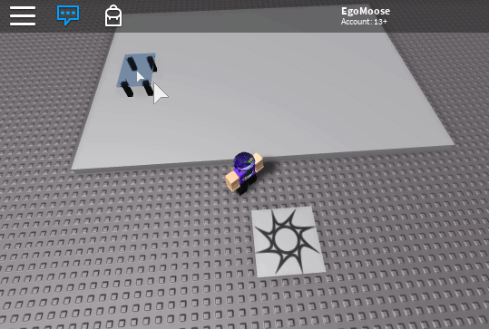 

Hope that helps!

## Edit 2

Okay, so I'm posting this as an addition because I have had quite a few people ask me how they could extend this to work on multiple parts such that the surface is no longer continuous or a perfect rectangle.

Instead people are asking how could they have their furniture placement system smoothly work on a set of surfaces like so:

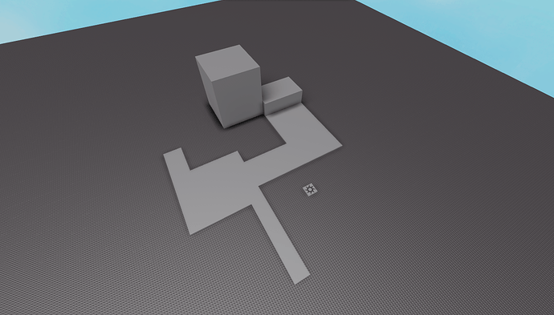 

Well to answer that I make a few assumptions. For one we are assuming that all the parts that make up this more complex larger canvas are all relatively axis aligned. This means the complex surface as a whole can be rotated, but each part individually can't have a unique rotation.

Once we have that simple setup applied we can use AABB collision detection to do some very simple and easy overlap calculations. For our purposes we'd like to be able to find the volume overlap of two parts (if any).

```Lua
local ZERO = Vector3.new(0, 0, 0)

--

local AABB = {}
AABB.__index = AABB

--

local function vec3Compare(a, b, func)
	return Vector3.new(
		func(a.x, b.x),
		func(a.y, b.y),
		func(a.z, b.z)
	)
end

--

function AABB.new(a, b)
	local self = setmetatable({}, AABB)
	
	self.Min = vec3Compare(a, b, math.min)
	self.Max = vec3Compare(a, b, math.max)
	
	return self
end

function AABB.fromPositionSize(pos, size)
	return AABB.new(pos + size/2, pos - size/2)
end

--

function AABB:Intersects(aabb)
	local aMax, aMin = self.Max, self.Min
	local bMax, bMin = aabb.Max, aabb.Min
	
	if (bMin.x > aMax.x) then return false end
	if (bMin.y > aMax.y) then return false end
	if (bMin.z > aMax.z) then return false end
	if (bMax.x < aMin.x) then return false end
	if (bMax.y < aMin.y) then return false end
	if (bMax.z < aMin.z) then return false end
	
	return true
end

function AABB:Union(aabb)
	if (not self:Intersects(aabb)) then
		return nil
	end
	
	local min = vec3Compare(aabb.Min, self.Min, math.max)
	local max = vec3Compare(aabb.Max, self.Max, math.min)
	
	return AABB.new(min, max)
end

--

return AABB
```

From there we just add an extra check to our placement code that ensures the full area of the item we want to be placed is covered by canvases that we can actually place on!

```Lua
-- loop through and update every placement's placement code
placements[i].CalcPlacementCFrame = function(self, model, position, rotation)
	local cf, size = self:CalcCanvas()
	local modelSize = worldBoundingBox(CFrame.Angles(0, rotation, 0), model.PrimaryPart.Size)
	
	-- use AABB to make sure the model has no 2D area on other canvases
	local sum = 0
	for j = 1, #placements do
		local canvasCF, canvasSize = placements[j]:CalcCanvas()
		local volume = overlap(
			CFrame.new(position) * (canvasCF - canvasCF.p), Vector3.new(modelSize.x, modelSize.z, 1),
			canvasCF, Vector3.new(canvasSize.x, canvasSize.y, 1)
		)
		sum = sum + volume
	end
	
	-- only clamp we're fully covered (margin of error included)
	local area = modelSize.x * modelSize.z
	local clamp = (sum < area - 0.1)

	local lpos = cf:pointToObjectSpace(position);
	local size2 = (size - Vector2.new(modelSize.x, modelSize.z))/2
	local x = clamp and math.clamp(lpos.x, -size2.x, size2.x) or lpos.x
	local y = clamp and math.clamp(lpos.y, -size2.y, size2.y) or lpos.y
	
	local g = self.GridUnit
	if (g > 0) then
		x = math.sign(x)*((math.abs(x) - math.abs(x) % g) + (size2.x % g))
		y = math.sign(y)*((math.abs(y) - math.abs(y) % g) + (size2.y % g))
	end
	
	return cf * CFrame.new(x, y, -modelSize.y/2) * CFrame.Angles(-math.pi/2, rotation, 0)
end
```

With those key concepts in mind you can now start to code a proper solution!

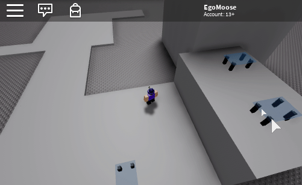 

Here's the placefile I used in the above gif. Just keep in mind if I were to code this from the get go it prob would have been a bit cleaner from an organization standpoint. Right now it's a bit spaghetti code-ish, but it does the job :grin:

[Placement Added.rbxl](other/furniturePlacement/placement_added.rbxl)