> This guide was originally written for [scriptinghelpers](https://scriptinghelpers.org/). The original can be found [here](https://scriptinghelpers.org/blog/modeling-a-projectiles-motion).

As a somewhat active member of the Scripting Helpers discord one of the most common questions I see is how to have a projectile travel an arc. Most people want to know how to do this for things like basketballs or cannon balls and so forth. Since this is such a popular question I thought it would be worth writing a blog post on it and talking about a few other things we can extend from our findings.

## Table of Contents

* [Deriving the equation](#deriving-the-equation)
* [Basketball example](#basketball-example)
* [Jump power and height](#jump-power-and-height)
* [Mapping the projectiles path with a beam](#mapping-the-projectiles-path-with-a-beam)

## Deriving the equation

Using basic knowledge of physics and simple calculus we can derive the basic equation of motion that a projectile will take.

We know that the derivative of position with respect to time is velocity and that the derivative of velocity with respect to time is acceleration. Thus, the reverse is also true, the integral of acceleration with respect to time is velocity and the integral of velocity with respect to time is position.

In our case we know that the only acceleration affecting our objects is gravity. Therefore, all we must do is integrate gravity with respect to time twice to give us an equation for position.

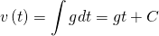

Due to the rules of indefinite integration we are left with an unknown constant, `C`, but using some intuition we can figure this out easily enough. We know that at `t = 0` our velocity should be equal to our initial velocity which we will define as `v0`.

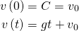

Next, we’ll integrate velocity with respect to time to find position.

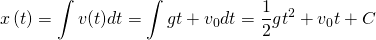

Similar to before we’re left with some constant, `C`, and again we know that at `t = 0` we should be at our initial position which we define as `x0`.

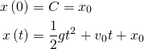

Awesome! We have a time-based equation for position!

## Basketball example

One of the neat things we can do with this equation is find the initial velocity needed to reach a certain target given time. To figure this out we define our target as `x1` and rearrange the position function from above for `v0`.

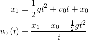

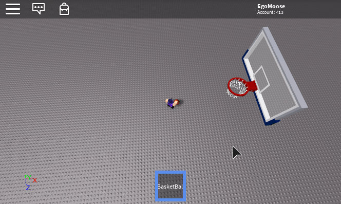

```Lua
local t = 1;
local mouse = game.Players.LocalPlayer:GetMouse();
local hrp = game.Players.LocalPlayer.CharacterAdded:Wait():WaitForChild("HumanoidRootPart");
local bball = script.Parent:WaitForChild("Handle");

mouse.Button1Down:Connect(function()
	local g = Vector3.new(0, -game.Workspace.Gravity, 0);
	local x0 = hrp.CFrame * Vector3.new(0, 2, -2)
	
	-- calculate the v0 needed to reach mouse.Hit.p
	local v0 = (mouse.Hit.p - x0 - 0.5*g*t*t)/t;
	
	-- have the ball travel that path
	local c = bball:Clone();
	c.Velocity = v0;
	c.CFrame = CFrame.new(x0);
	c.CanCollide = true;
	c.Parent = game.Workspace;
end)
```

Alternatively we could do this directly with CFrames if we didn't care as much about the collisions.

```Lua
local t = 1;
local mouse = game.Players.LocalPlayer:GetMouse();
local hrp = game.Players.LocalPlayer.CharacterAdded:Wait():WaitForChild("HumanoidRootPart");
local bball = script.Parent:WaitForChild("Handle");
local rs = game:GetService("RunService").RenderStepped;

mouse.Button1Down:Connect(function()
	local g = Vector3.new(0, -game.Workspace.Gravity, 0);
	local x0 = hrp.CFrame * Vector3.new(0, 2, -2)
	
	-- calculate the v0 needed to reach mouse.Hit.p
	local v0 = (mouse.Hit.p - x0 - 0.5*g*t*t)/t;
	
	local c = bball:Clone();
	c.CanCollide = true;
	c.Anchored = true;
	c.Parent = game.Workspace;
	
	-- have the ball travel that path
	local nt = 0;
	while (nt < t*2) do
		c.CFrame = CFrame.new(0.5*g*nt*nt + v0*nt + x0);
		nt = nt + rs:Wait();
	end
end)
```

## Jump power and height

For those of you who are unaware the property [Humanoid.JumpPower](https://www.robloxdev.com/api-reference/property/Humanoid/JumpPower) can be thought of as the `v0` used to model a jump. We can use this information with the position equation we derived to find the height of our jump or even the jump power we need to reach a certain height.

To find the jump height we need again to draw on some basic calculus intuition. We know that the derivative of a function allows us to calculate the slope at any given point. Looking at an example position function we can see that since it’s a parabola, its maximum height coincides with a slope of zero.

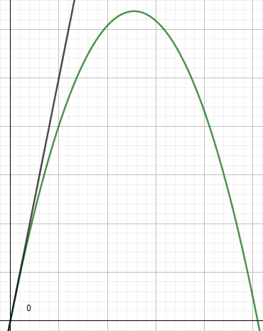

We already know the derivative of the position function is `v(t)` so if we set it equal to zero and solve for `t` then we know the time value when the position function has reached its maximum height.

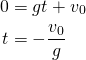

We can take this time value and plug it into the position function to have a formula for jump height.

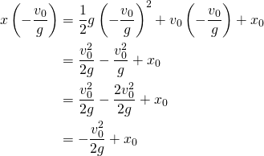

Noting that the initial height (position) is zero we’re left with the following formula to find jump height which we’ll define as `h`.

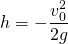

We can rearrange this formula to find `v0` (jump power) given a non-negative height.

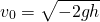

We can also look at the original position equation and solve for `x(t) = 0` with the quadratic equation to find the time it takes for the jump land.

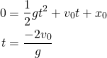

Unsurprisingly, this gives us the max height time value doubled since it takes the same amount of time to go up as it does down. 

```Lua
local humanoid = game.Players.LocalPlayer.CharacterAdded:Wait():WaitForChild("Humanoid");

-- note that typically gravity should be a negative value, but in this case I leave it positive hence the lack of -2 throughout the code
-- set the jump height to 10
humanoid.JumpPower = math.sqrt(2*game.Workspace.Gravity*10);

humanoid.StateChanged:Connect(function(old, new)
	if (new == Enum.HumanoidStateType.Jumping) then
		local h = humanoid.JumpPower^2/(2*game.Workspace.Gravity);
		local t = 2*humanoid.JumpPower/game.Workspace.Gravity;
		wait(t);
		print(string.format("Jump took %s seconds and reached a max height of %s studs", t, h));
	end
end)
```

## Mapping the projectile’s path with a beam

One of the common things people like to do with this equation is use it to help players aim. The simplest way to do this would be to draw parts between intervals on the curve. However, another way to do this is to use beams!

Beams are represented by cubic Bezier curves which is great because it means they can perfectly match any polynomial that is at most of third degree (meaning cubic). Our function is second degree (quadratic) so we’re all set.

Our first step is going to be to head over to the [Wikipedia page on Bezier curves](https://en.wikipedia.org/wiki/B%C3%A9zier_curve#Cubic_B%C3%A9zier_curves). Luckily for us they already have the cubic Bezier curve equation and the first derivative which we’ll also be needing.

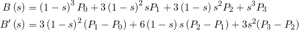

A few things we should take note of here if we’re trying to find a Bezier curve equivalent to our projectile motion function. We know that `P0 = x0` and that `P3 = x1`, thus we have two unknowns we want to solve for, `P1` and `P2`. We can also recognize that the Bezier curve function is normalized such that `s = [0, 1]`. As such we’ll need to similarly normalize our position and velocity functions as we’ll be using them soon.

We’ll define `t1` as the time value that can be used to find `x1`, that is `x(t1) = x1`.


We will now set these equal to the two Bezier functions and solve for the unknowns. We’ll make sure to pick `s` values that make this process as easy as possible.

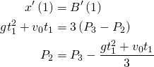

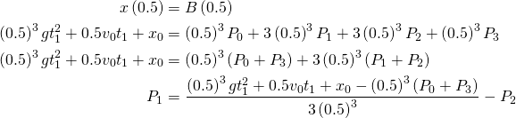

Great, we now have all four points that make up the equivalent Bezier curve. Our next step is to look at the [beam wiki page](https://www.robloxdev.com/api-reference/class/Beam) and see how these points can be used to find the correct values and properties we need to adjust to find our beam object.

Looking at the page it seems that `P1` and `P2` are defined by the following: 

```
P1 = attachment0.WorldCFrame.rightVector * beam.CurveSize0
P2 = -attachment1.WorldCFrame.rightVector * beam.CurveSize1
```

As such the last step is going to be to calculate these world CFrame values such that the right vectors are parallel with `P1 – P0` and `P3 – P2`. This is easy enough with knowledge of the cross product and how the [CFrame rotation matrix is formed](https://www.robloxdev.com/articles/CFrame-Math-Operations).

As such our final code is:

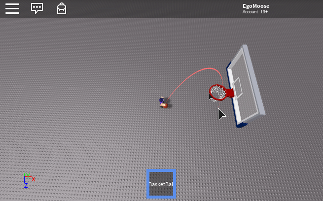 

```Lua
local attach0 = Instance.new("Attachment", game.Workspace.Terrain);
local attach1 = Instance.new("Attachment", game.Workspace.Terrain);

local beam = Instance.new("Beam", game.Workspace.Terrain);
beam.Attachment0 = attach0;
beam.Attachment1 = attach1;

local function beamProjectile(g, v0, x0, t1)
	-- calculate the bezier points
	local c = 0.5*0.5*0.5;
	local p3 = 0.5*g*t1*t1 + v0*t1 + x0;
	local p2 = p3 - (g*t1*t1 + v0*t1)/3;
	local p1 = (c*g*t1*t1 + 0.5*v0*t1 + x0 - c*(x0+p3))/(3*c) - p2;
	
	-- the curve sizes
	local curve0 = (p1 - x0).magnitude;
	local curve1 = (p2 - p3).magnitude;
	
	-- build the world CFrames for the attachments
	local b = (x0 - p3).unit;
	local r1 = (p1 - x0).unit;
	local u1 = r1:Cross(b).unit;
	local r2 = (p2 - p3).unit;
	local u2 = r2:Cross(b).unit;
	b = u1:Cross(r1).unit;
	
	local cf1 = CFrame.new(
		x0.x, x0.y, x0.z,
		r1.x, u1.x, b.x,
		r1.y, u1.y, b.y,
		r1.z, u1.z, b.z
	)
	
	local cf2 = CFrame.new(
		p3.x, p3.y, p3.z,
		r2.x, u2.x, b.x,
		r2.y, u2.y, b.y,
		r2.z, u2.z, b.z
	)
	
	return curve0, -curve1, cf1, cf2;
end

game:GetService("RunService").RenderStepped:Connect(function(dt)
	local g = Vector3.new(0, -game.Workspace.Gravity, 0);
	local x0 = hrp.CFrame * Vector3.new(0, 2, -2)
	local v0 = (mouse.Hit.p - x0 - 0.5*g*t*t)/t;
	
	local curve0, curve1, cf1, cf2 = beamProjectile(g, v0, x0, t);
	beam.CurveSize0 = curve0;
	beam.CurveSize1 = curve1;
	-- convert world space CFrames to be relative to the attachment parent
	attach0.CFrame = attach0.Parent.CFrame:inverse() * cf1;
	attach1.CFrame = attach1.Parent.CFrame:inverse() * cf2;
end)
```

## Edit

So recently [@CloneTrooper1019](https://twitter.com/CloneTeee1019) posted [this](https://twitter.com/CloneTeee1019/status/1139272882998128640) on twitter and through a series of events I was asked if I would post a tutorial showing how to do it. I'm not sure if this is exactly how Clone did it, but this is how I approached it.

So to start off let's cover the process that doing something like this would entail.

1. Start with a position and velocity which we can use the above equations to find the projectile's path.
2. Find where this path intersects with in game geometry.
3. Reflect the current velocity against the geometry's surface.
4. Use the intersection position and reflected velocity to repeat from step 1 as many times as desired.

We already know how to do steps 1 and 4 from the above post so all we need to cover are steps 2 and 3.

To find where our projectile intersects with a surface we'll do two things. 

We'll first split our projectile's path into multiple rays which can then be used to find an intersection with in game geometry. 

```Lua
local g = Vector3.new(0, game.Workspace.Gravity, 0)

local function x(t, v0, x0)
	return 0.5*g*t*t + v0*t + x0
end

local function intersection(x0, v0)
	local t = 0
	local hit, pos, normal
	
	repeat
		local p0 = x(t, v0, x0)
		local p1 = x(t + 0.1, v0, x0)
		t = t + 0.1
		
		local ray = Ray.new(p0, p1 - p0)
		hit, pos, normal = game.Workspace:FindPartOnRay(ray)
	until (hit or t > 5)
	
	-- so our plane is defined by the pos and normal variables
end
```

This will provide two key pieces of information; an estimated intersection position and a surface normal. We'll then use those pieces of information to do a plane-quadratic intersection which will give us an exact intersection value.

Using a general form of the quadratic formula:

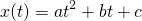 

We know the quadratic will intersect with a plane defined by `P` and `N` when:

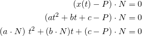 

This gives us two situations where we solve for t differently.

The first being when `a . N ≠ 0` in which case we use the quadratic formula.

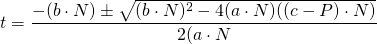 

The second being when `a . N = 0` in which case we simple solve the linear equation for t:

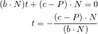 

In code this translates to:

```Lua
local function planeQuadraticIntersection(v0, x0, p, n)
	local a = (0.5*g):Dot(n)
	local b = v0:Dot(n)
	local c = (x0 - p):Dot(n)
	
	if (a ~= 0) then
		local d = math.sqrt(b*b - 4*a*c)
		return (-b - d)/(2*a)
	else
		return -c / b
	end
end
```

All that's left is to solve step 3 which is to reflect our velocity vector against the surface normal. This is simple enough and is currently explained on the [dot product](https://developer.roblox.com/articles/Calculating-Dot-Products) devhub wiki page. The only thing you might do here is slightly damp the velocity such that your reflection loses some energy as it bounces.

When you put all that together you get:

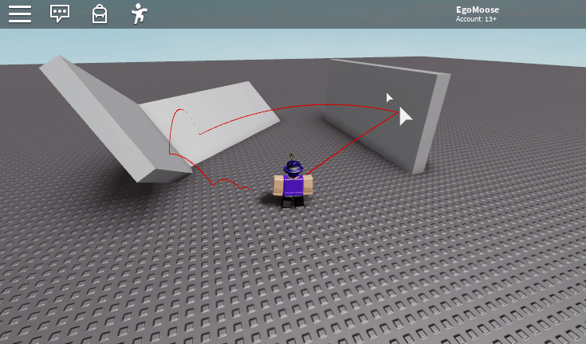

It's not perfect mainly because how velocity is damped, but it's a pretty good projection of the path traveled. Enjoy!

[Trajectory.rbxl](other/projectileMotion/Trajectory.rbxl) 