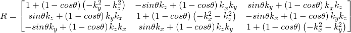
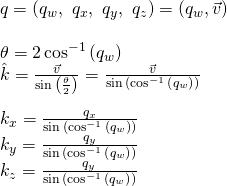
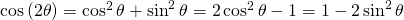
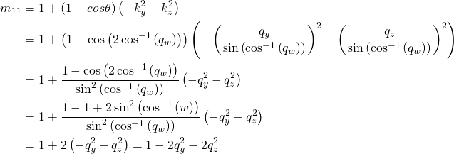
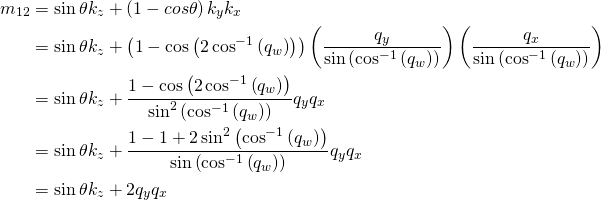
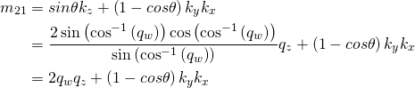
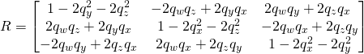
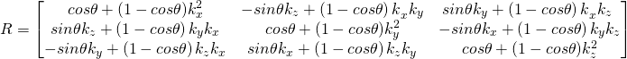

Sometimes it is useful to be able to convert a quaternion into a rotation matrix and vice versa. In this article we will go over how to do both those things. Readers will need an understanding of the [matrix form of the Rodrigues' rotation](https://github.com/EgoMoose/Articles/blob/master/Rodrigues'%20rotation/Rodrigues'%20rotation.md#matrix-form) in order to follow this article.

## Table of Contents

## Quaternion to Matrix

This is easy enough given that we convert a quaternion to a Rodrigues' rotation and then plug those values into the matrix.



First the quaternion values converted to Rodrigues' rotation values:



Now using a couple [trigonometric identities](https://en.wikipedia.org/wiki/List_of_trigonometric_identities) we can plug in an simplify the rotation matrix.

The first identity we will use is:



We can use this identity to simplify the diagonal elements of the matrix. For example, the `m11` component.



We can also use this identity to simplify the product of two k components multiplying against `1 - cosθ`. For example, the second term of the `m21` component.



The second identity we will use is:


We can use this identity for any single k-value multiplying against `sinθ`. For example, the first term in the `m21` component.



Thus using these two identities we can rewrite the rotation matrix:



Which is the form commonly used to [convert quaternions to a rotation matrix](https://en.wikipedia.org/wiki/Quaternions_and_spatial_rotation#Quaternion-derived_rotation_matrix).

```Lua
local function quaternionToCFrame(w, x, y, z)
	return CFrame.new(0, 0, 0,
		1-2*(y*y+z*z), 2*(y*x-w*z), 2*(w*y+z*x),
		2*(w*z+y*x), 1-2*(x*x+z*z), 2*(z*y-w*x),
		2*(z*x-w*y), 2*(w*x+z*y), 1-2*(x*x+y*y)
	);
end

local w, x, y, z = 1, 1, 0, 0
local m = math.sqrt(w*w + x*x + y*y + z*z);
w, x, y, z = w/m, x/m, y/m, z/m;

local cf1 = CFrame.new(0, 0, 0, x, y, z, w);
local cf2 = quaternionToCFrame(w, x, y, z);

-- if you take into account small floating point errors then they're the same!
print(cf1);
-- 0, 0, 0, 1, 0, 0, 0, -1.1920929e-07, -1.00000012, 0, 1.00000012, -1.1920929e-07
print(cf2);
-- 0, 0, 0, 1, 0, 0, 0, 2.22044605e-16, -1, 0, 1, 2.22044605e-16
```

## Matrix to quaternion

Once again we start with a form of the Rodrigues' rotation matrix.



**Incomplete**
