Sometimes it is useful to be able to convert a quaternion into a rotation matrix and vice versa. In this article we will go over how to do both those things. Readers will need an understanding of the [matrix form of the Rodrigues' rotation](https://github.com/EgoMoose/Articles/blob/master/Rodrigues'%20rotation/Rodrigues'%20rotation.md#matrix-form) in order to follow this article.

## Table of Contents

* [Quaternion to Matrix](#quaternion-to-matrix)
* [Matrix to Quaternion](#matrix-to-quaternion)
	* [Finding qw](#finding-qw)
	* [Crash course in Eigenvalues and Eigenvectors](#crash-course-in-eigenvalues-and-eigenvectors)
	* [Axis of rotation](#axis-of-rotation)
	* [Degenerate cases](#degenerate-cases)

## Quaternion to Matrix

This is easy enough given that we convert a quaternion to a Rodrigues' rotation and then plug those values into the matrix.


First the quaternion values converted to Rodrigues' rotation values:


Now using a couple [trigonometric identities](https://en.wikipedia.org/wiki/List_of_trigonometric_identities) we can plug in an simplify the rotation matrix.

**The first identity we will use is:**


We can use this identity to simplify the diagonal elements of the matrix. For example, the `m11` component.


We can also use this identity to simplify the product of two k components multiplying against `1 - cosθ`. For example, the second term of the `m21` component.


**The second identity we will use is:**


We can use this identity for any single k-value multiplying against `sinθ`. For example, the first term in the `m21` component.


Thus using these two identities we can rewrite the rotation matrix:


Which is the form commonly used to [convert quaternions to a rotation matrix](https://en.wikipedia.org/wiki/Quaternions_and_spatial_rotation#Quaternion-derived_rotation_matrix).

```Lua
local function quaternionToCFrame(w, x, y, z)
	return CFrame.new(0, 0, 0,
		1-2*(y*y+z*z), 2*(y*x-w*z), 2*(w*y+z*x),
		2*(w*z+y*x), 1-2*(x*x+z*z), 2*(z*y-w*x),
		2*(z*x-w*y), 2*(w*x+z*y), 1-2*(x*x+y*y)
	);
end

local w, x, y, z = 1, 1, 0, 0
local m = math.sqrt(w*w + x*x + y*y + z*z);
w, x, y, z = w/m, x/m, y/m, z/m;

local cf1 = CFrame.new(0, 0, 0, x, y, z, w);
local cf2 = quaternionToCFrame(w, x, y, z);

-- if you take into account small floating point errors then they're the same!
print(cf1);
-- 0, 0, 0, 1, 0, 0, 0, -1.1920929e-07, -1.00000012, 0, 1.00000012, -1.1920929e-07
print(cf2);
-- 0, 0, 0, 1, 0, 0, 0, 2.22044605e-16, -1, 0, 1, 2.22044605e-16
```

## Matrix to Quaternion

### Finding qw

We start by taking the trace (sum of diagonal elements) of the rotation matrix from the previous section and simplifying.


Since we're dealing with a unit quaternion we know that `qw^2 + qx^2 + qy^2 + qz^2 = 1` which can be used to further simplify.

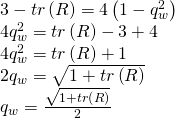

Awesome we have solved for `qw`! 

In code form:

```Lua
local cf = CFrame.Angles(math.pi/2, math.pi/2, math.pi/2);
local x, y, z, m11, m12, m13, m21, m22, m23, m31, m32, m33 = cf:components()

local qw = math.sqrt(1 + m11 + m22 + m33) * 0.5; 
```

### Crash course in Eigenvalues and Eigenvectors

To find the axis of rotation we are going to use eigenvalues and eigenvectors. This can be a pretty confusing subject in math, but let me give you a very basic understanding of what eigenvalues and eigenvectors are.

When we apply a transformation to a vector through a matrix there is a possibility that we don’t change the direction of the vector. Think for example of a very simple scaling matrix where c is the scaling constant:

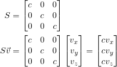

When we find a vector that when multiplied against our matrix doesn’t change the direction we consider that to be an eigenvector. The amount we scale the eigenvector by is called an eigenvalue

In this case when we multiply `S` by any non zero vector `v` we get a new vector going in the same direction as `v` but scaled by `c`. Thus, any non-zero vector is an eigenvector and `c` is the eigenvalue.

In other words `v` is an eigenvector and `λ` is an eigenvalue when for any given matrix M we get:

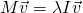

### Axis of rotation

We know the axis of rotation is an eigen vector of the rotation matrix because when we multiply the two we simply get the axis of rotation unchanged.

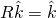

Alternatively, you can plug this into the non-matrix version since it gives the same result.

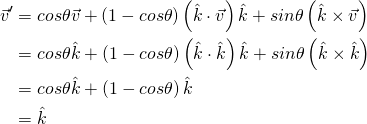

We can also take note that since we plug in `k` and get an unscaled `k` returned it must be true that the eigenvalue is 1. With that in mind we can write the following relationship:

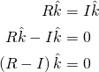

Using the standard approach to find the eigenvectors can get a bit painful so we are going to use a bit of a cheat that we are only getting away with because a rotation matrix is orthonormal and thus it’s [inverse is it’s transpose](https://github.com/EgoMoose/Articles/blob/master/CFrames/CFrame%20inversion.md).

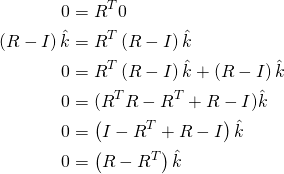

We will use this to solve for `k` components by noting that `R - R^T` is a [skew-symetric matrix](https://en.wikipedia.org/wiki/Skew-symmetric_matrix) that when multiplied against `k` is equivalent to the cross product.

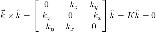

Thus, we can calculate the `K` matrix with `R - R^T`.

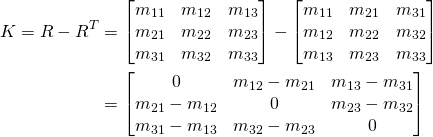

We then take the corresponding components to find the non-normalized k-value.

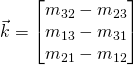

We could normalize this, find the angle, and then use it to find the rest of the q-values, but that's actually doing extra work. Suppose we take the rotation matrix we started with and go through the same process to find the k-components

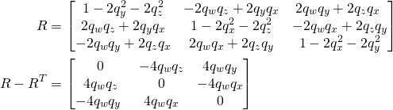

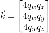

Now comparing these new components to the old ones and rearranging:

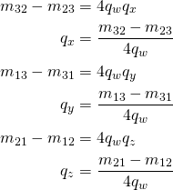

Awesome! Since we already have `qw` from earlier this is a much better approach to finding the rest of the quaternion values.

In code form:

```Lua
local cf = CFrame.Angles(math.pi/2, math.pi/2, math.pi/2);
local x, y, z, m11, m12, m13, m21, m22, m23, m31, m32, m33 = cf:components()

local qw = math.sqrt(1 + m11 + m22 + m33) * 0.5;
local qx = (m32-m23) / (4*qw);
local qy = (m13-m31) / (4*qw);
local qz = (m21-m12) / (4*qw);
```

### Degenerate cases

The above code is great and all, but what happens if `qw` equals zero? Unfortunately, this leads to a nonsense result where our quaternion values are not representative of the matrix we derived them from.

So how do we deal with this then? Well originally we calculated `qw` first and then used it to scale the rest of the quaternion values. If instead we use some variation of the trace to calculate one of the other components we can instead use them to find the other quaternion values.

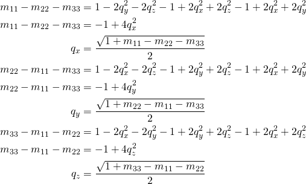

Of course if we are not careful we might end up picking an intial quaternion component that again leads us to a nonsense reslt (division by zero). To avoid this and pick a valid initial component we must use some intuition. We know we're dealing with a unit quaternion thus, `qw^2 + qx^2 + qy^2 + qz^2 = 1`. In order for that statement to be true the largest component can at minimum be `0.5`. Thus if we ensure that the initial component is at least `0.5` then we know we'll get a valid result for the rest of the components.

This leaves us with a process we must check.

1. **If `m11 + m22 + m33 > 0` then start with `qw`.**

```Lua
local qw = math.sqrt(1 + m11 + m22 + m33) * 0.5;
```

We know that if `m11 + m22 + m33 > 0` then `qw` will be a value greater than `0.5` and anything else will be less than `0.5`.

2. **Otherwise if `m11 > m22` and `m11 > m33` then start with `qx`.**

```Lua
local qx = math.sqrt(1 + m11 - m22 - m33) * 0.5;
```

Your first instinct like in the `qw` case might be to see if `m11 - m22 - m33` is greater than zero, but there's better way. If we compare the diagonals of our quaternion matrix we can see that `qx` is greater than `qy` and `qz` if `m11 > m22` and `m11 > m33`.

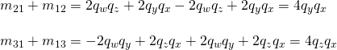

After adding some of the quaternion matrix components together and rearranging we can use `qx` to scale for the remaining values.

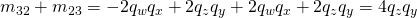

3. **Otherwise if `m22 > m33` then start with `qy`.**

```Lua
local qy = math.sqrt(1 + m22 - m11 - m33) * 0.5;
```

Using the same logic of comparing diagonals we know that if `qw` and `qx` are not the largest elements then if `m22 > m33` then `qy` is the largest since it's greater than `qz`.

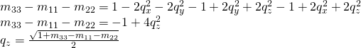

After adding some of the quaternion matrix components together and rearranging we can use `qy` to scale for the remaining values.

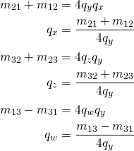

4. **Otherwise use `qz`.**

```Lua
qz = math.sqrt(1 + m33 - m11 - m22) * 0.5;
```

Assuming all the other cases didn't pass then we're left with `qz` as the largest value and again we can use some quaternion matrix components to find out how to use it to scale for the other components.

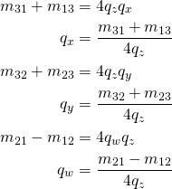

**Putting it all together**

```Lua
local function matrixToQuaternion(cf)
	local x, y, z, m11, m12, m13, m21, m22, m23, m31, m32, m33 = cf:components();
	local qw, qx, qy, qz;
	
	if (m11 + m22 + m33 > 0) then
		qw = math.sqrt(1 + m11 + m22 + m33) * 0.5;
		qx = (m32-m23) / (4*qw);
		qy = (m13-m31) / (4*qw);
		qz = (m21-m12) / (4*qw);
	elseif (m11 > m22 and m11 > m33) then
		qx = math.sqrt(1 + m11 - m22 - m33) * 0.5;
		qy = (m21+m12) / (4*qx);
		qz = (m31+m13) / (4*qx);
		qw = (m32-m23) / (4*qx);
	elseif (m22 > m33) then
		qy = math.sqrt(1 + m22 - m11 - m33) * 0.5;
		qx = (m21+m12) / (4*qy);
		qz = (m32+m23) / (4*qy);
		qw = (m13-m31) / (4*qy);
	else
		qz = math.sqrt(1 + m33 - m11 - m22) * 0.5;
		qx = (m31+m13) / (4*qz);
		qy = (m32+m23) / (4*qz);
		qw = (m21-m12) / (4*qz);
	end
	
	return qw, qx, qy, qz;
end
```

