# Rotation Quaternions and slerping

This article aims to cover the technical aspects of rotation quaternions (i.e. how to write a quaternion class). Readers are recommended to have read the [Rodrigues' rotation](https://github.com/EgoMoose/Articles/blob/master/Rodrigues'%20rotation/Rodrigues'%20rotation.md) article ahead of time as it will be used to compare results.

## Table of Contents

* [Crash course on imaginiary/complex numbers](#crash-course-on-imaginiarycomplex-numbers)
* [The quaternion is born](#the-quaternion-is-born)
* [Quaternion operations](#quaternion-operations)
* [Rotation Quaternion intuition](#rotation-quaternion-intuition)
	* [Single axis rotations](#single-axis-rotations)
	* [Two axis rotations](#two-axis-rotations)
	* [All axes rotation](#all-axes-rotation)
	* [Intuition recap](#intuition-recap)
* [SLERPing](#slerping)
	* [Conversion to Rodrigues rotation](#conversion-to-rodrigues-rotation)
	* [SLERP](#slerp)

## Crash course on imaginiary/complex numbers

Before we can get into understanding quaternions we first need to understand the concept of imaginary and complex numbers. The names might seem daunting, but for our purposes the concepts are pretty straight forward. 

Imaginary numbers have a very simple purpose, to solve equations that real numbers couldn’t! For example: 

`x^2 + 25 = 0`

There is no real number solution to this equation because any real number we take to the power of two will result in a positive number. So in order for the above equation to be true it must be that:

`x^2 = -25`

This is what we call an imaginary number. They are special in the sense that they square to a real negative value. So far we have used `x` as a variable, but usually when representing imaginary numbers we use what is called the imaginary unit `i` where `i^2 = -1`. That way we can reprsent any imaginary number as a product of a real number and `i`. For example:

`(5*i)^2 + 25 = 25*(i^2) + 25 = -25 + 25 = 0`

You might notice that the imaginary unit has a pattern when taken to different powers:

Power Pattern |
------------ |
`i^0 = 1` |
`i^1 = i` |
`i^2 = -1` |
`i^3 = -i` |
`i^4 = 1` |
`i^5 = i` |
`i^6 = -1` |
`i^7 = -i` |
... |

You'll note that this pattern also holds true for negative powers. Simply take notice that `i^-1 = 1/i * i/i = i/i^2 = i/-1 = -i` and the rest of the negative powers become trivial to calculate.

This pattern of `1, i, -1, -i` may feel familiar to you. If we treat the real number part of the pattern as being on the x-axis and the imaginiary parts as being on the y-axis then the pattern is essentially the same as `x , y, -x, -y` which is rotating 90 degrees counter-clockwise.

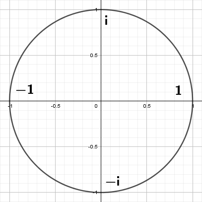

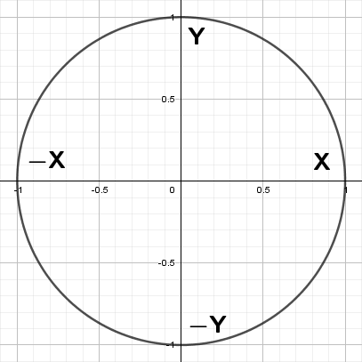

Since these patterns share so much in common we can use a combination of imaginary and real numbers to represent numbers on a two dimensional grid. We call these complex numbers and we place them on the complex plane.

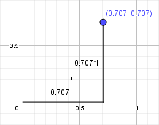

Interestingly, if we multiply a complex number by `i` we're left with a resulting complex number that has been rotated 90 degrees counter-clockwise.

```
(2 + i)
(2 + i)*i = 2*i + i^2 = -1 + 2*i
(2 + i)*i^2 = (-1 + 2*i)*i = -i + 2*i^2 = -2 - i
(2 + i)*i^3 = (-2 - i)*i = -2*i - i^2 = 1 - 2*i
(2 + i)*i^4 = (1 - 2*i)*i = i - 2*i^2 = 2 + i
```

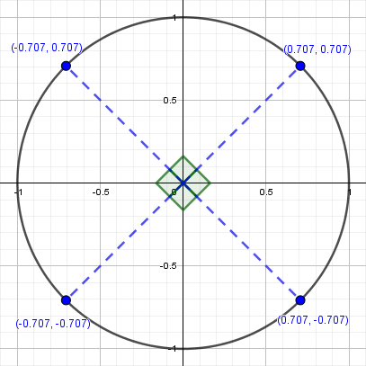

We can expand on this concept by instead multiplying with a complex number that gives us control of the angle we rotate by.

We can trace a unit circle with `cosθ + sinθ*i` so if we multiply it by a complex number we get a general formula for rotating counter-clockwise by any angle, we call this a rotor.

```
(w + xi)*(cosθ + sinθ*i)
= w*cosθ + w*sinθ*i + x*cosθ*i + x*sinθ*i^2
= w*cosθ - x*sinθ + (w*sinθ + x*cosθ)i
```

You might be somewhat familiar with this formula. It's just the 2D rotation matrix in complex number form!

## The quaternion is born

Prior to quaternions most people saw the complex plane in 2D and simply figured if they wanted to add a third dimension they just had to add another imaginary number, say `j^2 = -1`. Quickly however they found this didn't quite work due to multiplication requiring us to know the product of two imaginary numbers.

```
(w1 + x1*i + y1*j)*(w2 + x2*i + y2*j) 
= w1*w2 + w1*x2*i + w1*y2*j + x1*w2*i + x1*x2*i^2 + x1*y2*i*j + y1*w2*j + y1*x2*j*i + y1*y2*j^2
= w1*w2 - x1*x2 - y1*y2 + (w1*x2 + x1*w2)*i + (w1*y2 + y1*w2)*j  + x1*y2*i*j + y1*x2*j*i
```

*Note: i*j and j*i are not communative due to their imaginary nature.*

For quite sometime this problem didn't see much attention until an Irish mathemetician named William Rowan Hamilton who figured the best way to solve it was to add a third imaginary number. 

Famously the condition he wrote was:

```
i^2 = j^2 = k^2 = i*j*k = -1
```

This may seem a bit confusing, but it we seperate this out (and again respect the non-commutativity) we get a few equalities we can use to expand.

```
i^2 = -1	j^2 = -1	k^2 = -1
i*j = k		j*k = i		k*i = j
j*i = -k	k*j = -i	i*k = -j
```

In short Hamilton said that instead of stumping ourselves by not knowing a real number that is the resulting product of two imaginary numbers just set its product to another imaginary number and from there we can figure stuff out.

## Quaternion operations

The goal of this section is going to be to start to take some of the knowledge we have learned about quaternions and convert it to code.

We have quaternions in the following form:

```
q = w + x*i + y*j + z*k
```

We can store that same information as an ordered pair by spliting up the real number part from the imagniary part. Thus the above becomes:

```
q = [w, x*i + y*j + z*k]
```

If we treat `i`, `j`, and `k` as seperate axes then we can store the second element of the ordered pair as a 3 dimensional vector.

```
v = (x, y, z)
q = [w, v]
```

If we wanted to add or subtract two quaternions its quite straight forward. We just add/subtract each individual component.

```
q1 = [w1, v1]	q2 = [w2, v2]
q1 + q2 = [w1 + w2, v1 + v2]
q1 - q2 = [w1 - w2, v1 - v2]
```

Multiplication is not quite as simple as addition and subtraction. We can figure out how to do this calculation by applying the equalities hamilton's equation.

```
q1 = w1 + x1*i + y1*j + z1*k	q2 = w2 + x2*i + y2*j + z2*k

q1 * q2 = (w1 + x1*i + y1*j + z1*k)*(w2 + x2*i + y2*j + z2*k)
        = w1*w2 + w1*(x2*i + y2*j + z2*k) + x1*w2*i + x1*x2*i^2 + x1*y2*i*j + x1*z2*i*k + y1*w2*j + y1*x2*j*i + y1*y2*j^2 + y1*z2*j*k + z1*w2*k + z1*x2*k*i + z1*y2*k*j + z1*z2*k^2
        = w1*w2 - x1*x2 - y1*y2 - z1*z2 + w1*(x2*i + y2*j + z2*k) + w2*(x1*i + y1*j + z1*k) + x1*y2*k - x1*z2*j - y1*x2*k + y1*z2*i + z1*x2*j - z1*y2*i
```

We can then convert this back to the ordered pair form:

```
q1 = [w1, v1]	q2 = [w2, v2]

q1 * q2 = [w1*w2 - (v1 . v2), w1*v2 + w2*v1 + (v1 x v2)]
```

We can use this form of the equation to find the inverse of a quaternion pretty easily. To start let's see what happens when we flip the `x`, `y`, and `z` components.

```
q = [w, v]	q^-1 = [w, -v]

q * q^-1 = [w*w + (v . v), w*v - w*v + (v x v)]
         = [w*w + (v . v), (0, 0, 0)]
         = [???, (0, 0, 0)]
```

That takes care of the `x`, `y`, and `z` components of our ordered pair, but as mentioned before we need `w` to equal `1`. Luckily, this turns out to be one extra operation from the above, just divide by `w*w + (v . v)`, which we call the conjugate. 

Thus, the true inverse of a quaternion is:

```
q = [w, v]	q^-1 = [w, -v] / (w*w + (v . v))

q * q^-1 = [w*w + (v . v), w*v - w*v + (v x v)] / (w*w + (v . v))
         = [w*w + (v . v), (0, 0, 0)] / (w*w + (v . v))
         = [1, (0, 0, 0)]
```

So taking everything we have learned we can put this in code form:

```Lua
local quaternion = {}
local quaternion_mt = {__index = quaternion};

function quaternion_mt.__mul(q0, q1)
	local w0, w1 = q0.w, q1.w;
	local v0, v1 = Vector3.new(q0.x, q0.y, q0.z), Vector3.new(q1.x, q1.y, q1.z)
	local nw = w0*w1 - v0:Dot(v1);
	local nv = v0*w1 + v1*w0 + v0:Cross(v1);
	return quaternion.new(nw, nv.x, nv.y, nv.z);
end

function quaternion_mt.__tostring(q)
	-- print as floats, be aware a more precise number is actually stored
	return string.format("%f, %f, %f, %f", q.w, q.x, q.y, q.z);
end

function quaternion.new(w, x, y, z)
	local self = {};
	
	self.w = w;
	self.x = x;
	self.y = y;
	self.z = z;
	
	return setmetatable(self, quaternion_mt);
end

function quaternion:inverse()
	local conjugate = self.w*self.w + self.x*self.x + self.y*self.y + self.z*self.z;
	return quaternion.new(self.w / conjugate, -self.x / conjugate, -self.y / conjugate, -self.z / conjugate);
end

-- examples:

local q1 = quaternion.new(0.5, 0.5, 0.5, 0.5);
local q2 = quaternion.new(1/math.sqrt(2), 1/math.sqrt(2), 0, 0);

print(q1 * q2);           -- 0.000000, 0.707107, 0.707107, 0.000000
print(q1 * q1:inverse()); -- 1.000000, 0.000000, 0.000000, 0.000000
print(q1:inverse() * q1); -- 1.000000, 0.000000, 0.000000, 0.000000
print(q2 * q2:inverse()); -- 1.000000, 0.000000, 0.000000, 0.000000
```

## Rotation Quaternion intuition

Now that we understand the basic operations of quaternions we can start to talk about how we can think about quaternions intuitively. A lot of people seem to think that since rotation quaternions are 4D they're really unintuitve for our 3D brains. I very much disagree with this statement and think that most people think this because they haven't been taught the basic underlying idea behind rotation quaternions. Hopefully, by the end of this section you will agree with me when I say quaternions aren't any more complex to think about compared to euler angles.

### Single axis rotations

To start let’s ask ourselves a question. How could we represent a 2D rotation with two numbers as opposed to one angle? The answer is quite trivial so no use overthinking it. We simply represent the rotation as coordinates on the circumfrence of a circle. For example, we might say 45 degrees is ~ `(0.707, 0.707)`.

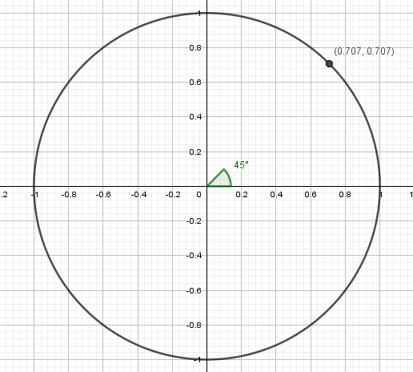

Quaternions around a single axis work in a somewhat similar way. In the above image we can see that `(0.707, 0.707)` represents 45 degrees, but if we were to plug those numbers into the W and X components of a quaternion we would get a rotation of 90 degrees around the X axis.

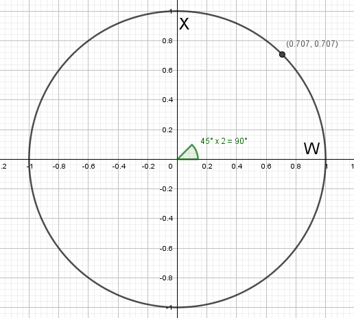

If we did this same exercise with other points, we would find a pattern. We can take any point on the circumfrence of the circle and find the angle. When we plug that point into the W and X components of a quaternion we rotate twice the amount of the angle represented on the circle. This is interesting because it implies that with quaternions we have 720 or 0 degrees of rotation at point `(1, 0)` and 360 degrees rotation at point `(-1, 0)`. We call this double cover and as we will see later it is one of the reasons quaternions are so useful!

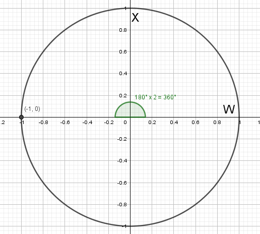

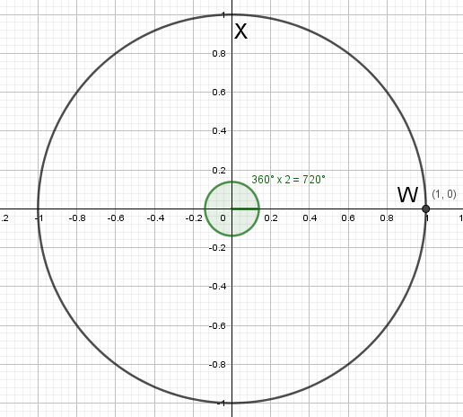

Even though we're looking at a single axis we can start to see some of the advantages that quaternions provide. Let’s start simply by seeing what happens when we flip the `W` component in our 90-degree rotation example.


You’ll notice that our total rotation is 270 degrees on the X-axis which is the same as -90 degrees on the X-axis. So very simply flipping the W component gives us the same magnitude of rotation, but in the opposite direction.

What if we flip all quaternion components?

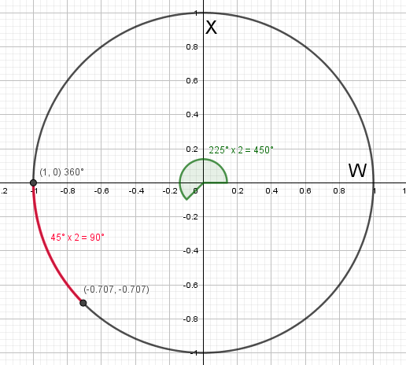

Now we can see the effects of double cover. The full rotation is 450 degrees which means technically speaking we’re doing a full 360-degree spin plus 90 degrees meaning when we flip all the components we end up with the exact same rotation. For lack of a better word I’ll refer to this as a quaternion twin. It’s the same end rotation represented by different numbers. The existence of these twins may seem redundant, but let’s think about why they’re useful.

Say we want to SLERP (spherical linear interpolation) between 90-degrees and 180-degrees on the X-axis. We might initially choose to pick our two points `(0.707, 0.707)` and `(0, 1)` and travel between them, but we could just as easily pick our two points to be `(0.707, 0.707)` and the twin `(0, -1)` since they represent the same end rotation. However, looking at the path traveled graphically we can see something neat!

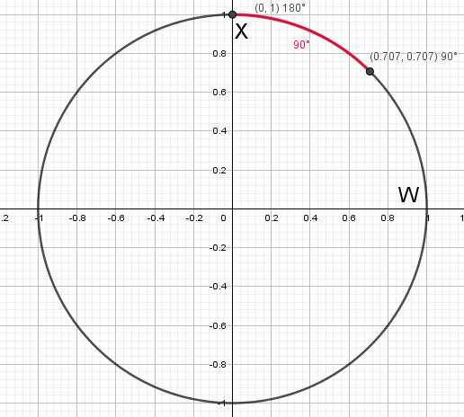

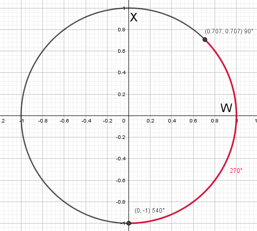

In one case the shortest path requires a clockwise rotation and in the other case the shortest path requires a counter-clockwise rotation. Thus, now we can see that flipping the components when SLERPing allows us to rotate in the opposite direction!

*Note: Quaternions are typically represented as `(W, X, Y, Z)`*

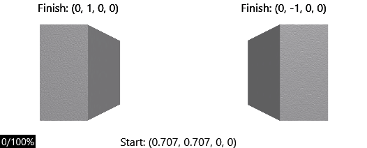

It's worth noting that typically when we SLERP we choose the quaternion twin that's closest to our intital rotation. This is pretty easy to do if we treat the quaternions as vectors and check the dot product. The geometric definition of the dot product is `a.b = |a||b|cosθ` thus since quaternions are on the surface of a unit sphere both their magnitudes will be `1` leaving only `cosθ`. If both quaternions are on the same half of the sphere the angle between them will be less than 180 degrees and thus `cosθ` will be positive and vice versa if the quaternion is on the other side of the sphere. Thus we compare the dot product between the starting quaternion and both twins and pick the twin with the positive dot product.


For those of you with keen eyes you may be wondering how a full 360-degree rotation would work when it comes to going the opposite direction? Unlike before if we cannot simply flip the components since that would leave us with two of the same quaternions. For example `(0, 1)` SLERPing to `(0, -1)` would give us a full 360 degrees rotation, but if we tried to get the second point’s twin we get `(0, 1)`, which leaves us with the same two points! Unfortunately, we have a bit of a special case, but there’s a simple enough solution if we just review what we already know.

Flip the `W` component!

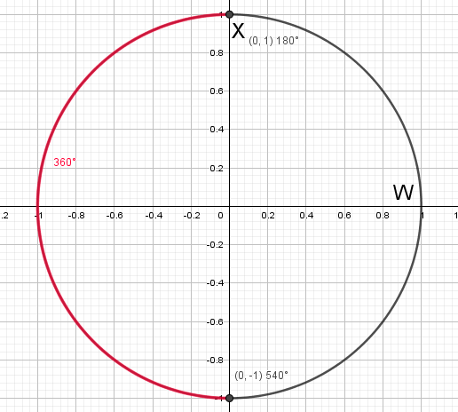

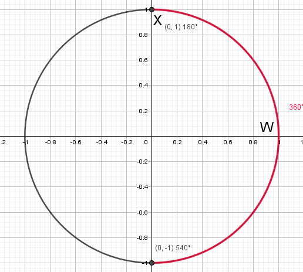

We can also use the single axis case to better understand what our multiplication operations is doing.

Say we multiply the two following quaternions together:

```
q1 = [0.707, (0.707, 0, 0)]		q2 = [0, (1, 0, 0)]

q3 = q1 * q2 
   = [0.707*0 - (0.707*1), 0.707*(1, 0, 0) + 0*(0.707, 0, 0) + ((0.707, 0, 0) x (1, 0, 0))]
   = [-0.707, (0.707107, 0, 0)]
```

If we plot those three quaternions we can see that the multiplication operator is stacking the rotations. For example, if we multiply a quaternion that represents 90 degrees on the x-axis against a quaternion that represents 180 degrees of rotation on the x-axis we get a quaternion representing 270 degrees of rotation on the x-axis.

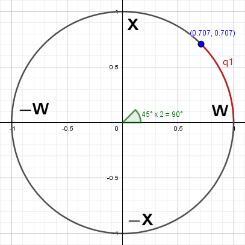

We can also start to see how the quaternion inverse represents what we'd have to multiply by to "undo" the rotation we just did.

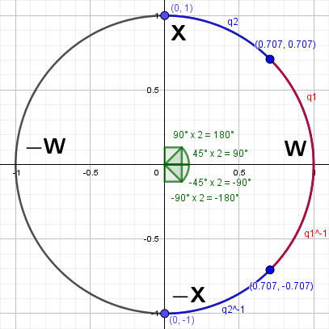

Of course this is very easy to visualize because we're on only one axis, but the same concepts apply to 3-axes rotations that use all four quaternion components. The one thing we have to be careful of is the order we apply rotations in as they are not commutative.

### Two axis rotations

So far, we have discussed how we can represent a single axis rotation using two numbers, but what about rotations on two axes? For that we need three numbers. In the same way that we labeled our single axis rotation quaternions as `W` and `X` components now we’ll label our two axes rotation quaternions as `W`, `X`, and `Y` components.

The same rules still apply as before. Our point must lay on the surface of the 3D sphere and the angle rotated is twice what is represented by the point.

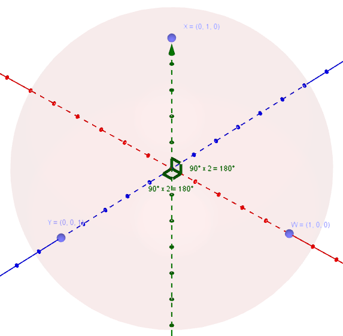

Therefore the point `(0, 0, 1)` is equivalent to 180-degrees around the Y-axis and the point `(0, 1, 0)` is equivalent to 180-degrees around the X-axis `(just like before)`.

Here we can start to see why a quaternion doubles the angle represented by the point. Let’s pretend that instead points `X` and `Y` did in fact represent 90 degrees on their respective axis. That means that the points that represents 180 degrees around both `X` and `Y` would be the same point, `(-1, 0, 0)`. Yikes! That doesn’t work. If we didn’t double the angle, then it would be impossible to rotate 180 degrees around `X` and 180 degrees around `Y` independently. Going back to actual quaternions however the point `(-1, 0, 0)` represents 360 degrees around both the `X` and `Y` axis which is the same as not rotating at all!

Back on topic, how can we think of points that aren’t directly `X`, `Y`, or `W`? Say we pick the midway point between `X` and `Y` which is `(0, 0.707, 0.707)`.


This point represents a half and half mix between the `X` and `Y` points which means it is a perfect blend in rotation between the 180 degrees on `X` and 180 degrees on `Y`.

What about the mid-point between all three points `W`, `X`, and `Y`? This isn’t as simple to think about since unlike `X` and `Y`, there’s no `W` axis. So how can we think of `W`?

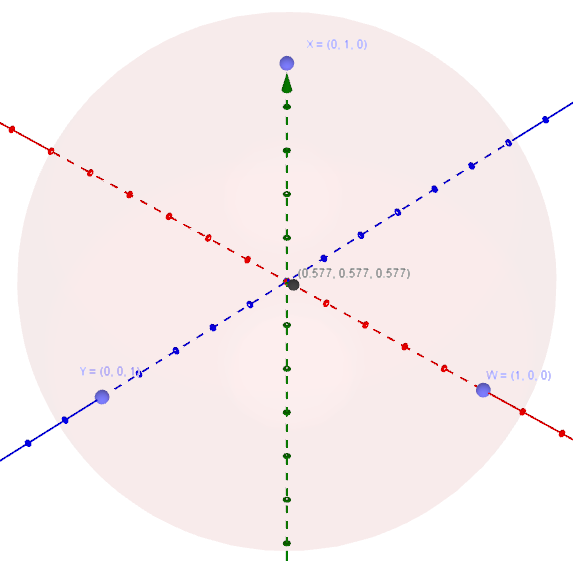

Well if we go back to our identity quaternion we know that `[1, (0, 0, 0)]` is the unrotated state. Thus, we can think of `W` as "non-rotation". Therefore, the point above represents a perfect blend of rotation between 180 degrees `X`, 180 degrees `Y`, and non-rotation.

Going back to our single axis case this new interpretation of `W` also helps us make sense of our previous quaternions. The quaternion `[0.707 (0.707, 0, 0)]` can now be thought of as an equal blend between 180 degrees on the X-axis and non-rotation, thus 90 degrees on the X-axis.

### All axes rotation

The concept of blending rotations on the surface of a circular object is exactly how full 4D quaternions work. The only problem is that we can’t visualize the full 3-axes form since it would be a 4D unit sphere. Hopefully though seeing and understanding the blending concept in lower dimensions will help you visualize how to manipulate full quaternions.

To make things even easier most quaternion classes automatically normalize any quaternion values you input to ensure they're on the surface of the 4D unit sphere. This might not seem like a huge deal, but it makes our abilities as programmers to blend quaternions way easier. Instead of having to calculate averages that lay on the surface of the 4D sphere we can instead say 1-part X-axis and 1-part Y-axis and let the CFrame figure out what that unit blend would be on surface of the 4D sphere. In other words it's like we're mixing paint. If we put 1 scoop of red paint and 1 scoop of green paint we get the same consitency yellow paint as we would with 2 scoops of red paint and 2 scoops of green paint.

Here are a few examples to help that understanding:

I've set these up so that you can see what is being blended.

```
W = (1, 0, 0, 0) => Unrotated
X = (0, 1, 0, 0) => 180 degrees around X-axis
Y = (0, 0, 1, 0) => 180 degrees around Y-axis 
Z = (0, 0, 0, 1) => 180 degrees around Z-axis
```

*Note: The CFrame constructor accepts quaternion components like so `CFrame.new(0, 0, 0, X, Y, Z, W)`*


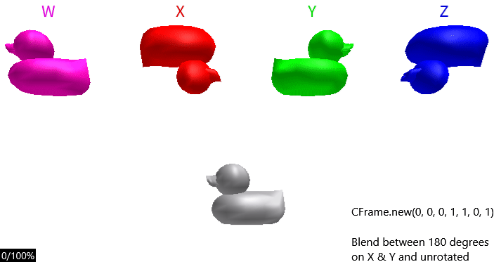

Hopefully you can see how it's a blend of the two, not just one full 180 degree rotation and then the other piled on top of each other.

I highly encourage for everyone to set something up like I have in the above gifs (or check out the placefile in the repo) and play around. It will help you get used to the concept of blending.

### Intuition recap

Let's recap what we have learned so far:

 * Rotation quaternions are always placed on the surface of sphere. This means their components squared should always equal one, `w^2 + x^2 + y^2 + z^2 = 1`.
 * The angle represented by the point on the sphere is doubled. This means we have a full 720 degrees of rotation giving us quaternion twins and double cover.
 * We can flip the `W` component of a quaternion to get the same magnitude of rotation but spinning in the opposite direction.
 * We can flip all components of a quaternion to get the quaternion's twin. This is useful for SLERPing because it allows us to reach the same end rotation, but spinning a different way.
 * We can use the dot product to find the closest twin when SLERPing.
 * Multiplying quaternions is equivalent to piling up rotations and because of this order matters! Quaternions are not communative.
 * When we manually input quaternion values we can think of points `X`, `Y`, and `Z` as being representative of 180 degrees around their respective axis and `W` as being non-rotation. We can use this visualization to think of quaternions as a blend between those four states where individual negative values represent the same magnitude rotation, but spinning in the opposite direction.

## SLERPing

We are now at the point of the article where we can start to talk about how SLERPing works from a math perspective. To do this we use our knowledge up to this point to convert our quaternion to a rodrigues rotation and slerp.

### Conversion to Rodrigues rotation

To convert to a Rodrigues rotation let's revist the begining of the article where we talked about rotors. In the same way that we traced a unit circle with `cosθ + sinθ*i` we can trace a 4D unit sphere with `[cosθ, sinθ*n]` where `n` is the unit vector axis of rotation and `θ` is the angle of rotation.

We know this isn't quite right though since quaternions double the angle that the point on the sphere represents. Thus, the accurate representation then would be:

```
q = [cos(θ/2), sin(θ/2)*n]
```

Once again intuitively this kinda makes sense. For example, if the angle is zero it doesn't matter what the axis values are since `cos(0) = 1` and `sin(0) = 0` which means we're left with a quaternion of `[1, (0, 0, 0)]`, the unrotated state.

Using this formula we can easily pull the axis and angle out of our quaternion values.

```
q = [w, v]

θ = cos^-1(w) * 2
n = v / sin(θ/2)
```

In code form:

```Lua
function quaternion:toAxisAngle()
	local v = Vector3.new(self.x, self.y, self.z);
	local theta = math.acos(self.w)*2;
	local axis = v / math.sin(theta*0.5);
	return axis, theta;
end
```

### SLERP

Now that we have a way to convert the quaternion to a rodrigues rotation we can simply find the delta (difference in rotation) between the two quaternions, lerp the angle, reconvert to a quaternion and add it to the starting point.

*Recall, we use the dot product to find the closest of the two twins*

In code:

```Lua
function quaternion:slerp(q2, t)
	local q1 = self;
	
	-- pick the closest twin
	if (q1.w*q2.w + q1.x*q2.x + q1.y*q2.y + q1.z*q2.z < 0) then
		q2 = quaternion.new(-q2.w, -q2.x, -q2.y, -q2.z);
	end
	
	-- get the difference between quaternions
	local delta = q2 * q1:inverse();
	-- convert to rodrigues rotation
	local axis, theta = delta:toAxisAngle();
	-- adjust the angle
	theta = theta * t;
	-- convert back to quaternion
	local v = math.sin(theta*0.5)*axis;
	delta = quaternion.new(math.cos(theta*0.5), v.x, v.y, v.z);
	-- add the difference back to the starting quaternion
	return delta * q1;
end
```
