# Rodrigues' rotation

Having the ability to rotate vectors is a very useful tool to have in your repotoire. One of the easiest ways to do this is by using Rodrigues' rotation formula. In this article we are going to discuss how the formula is derived.

## Table of Contents  

* [Breaking up the formula](#breaking-up-the-formula)
	* [Geometric proof](#geometric-proof)
	* [Algebraic proof](#algebraic-proof)
* [Rotating around a circle](#rotating-around-a-circle)
* [Putting it all together](#putting-it-all-together)
* [2D rotation matrix](#2d-rotation-matrix)
* [Matrix form](#matrix-form)

## Breaking up the formula

To start off let's look at what a Rodrigues' rotation actually looks like.

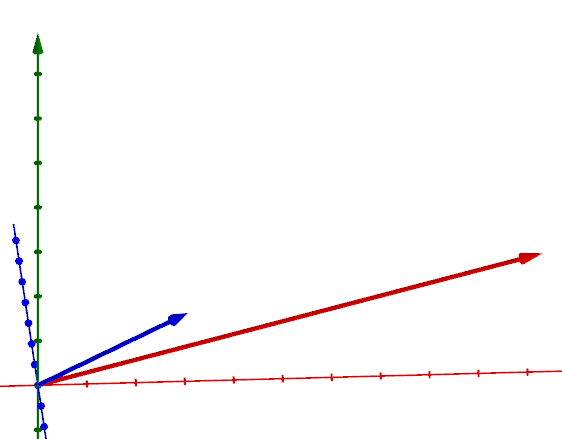

By drawing a few extra parts we can see the formula is rotating the red vector around the blue vector much like the axel of a car.

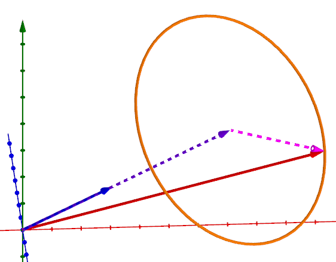

We can start by labeling the parts we just drew and then finding their values.


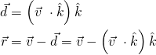

In order to properly rotate we'll need two perpendicular vectors that trace the edge of the circle. We already have one of these in the form of `r`. To get the second one we will cross `k` and `v` to give us `r*`.

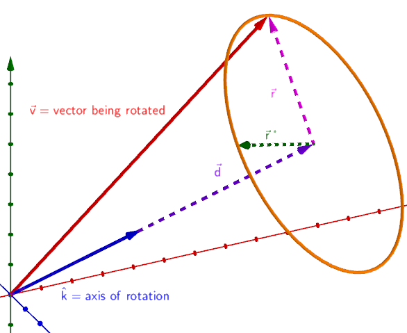

You might be thinking that crossing `k` and `v` seems like an odd choice, after all we're trying to find a perpendicular vector with the same magnitude as `r`. To show that the magnitude of `r*` is the same as the magnitude of `r` we will compare to a more obvious cross product choice that we know would have the correct magnitude.

Claim:
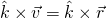

### Geometric proof

If we look at a side view of our vectors and use basic trigonic intuition (SOHCAHTOA) we can see the angle between `k` and `v` scales the cross product magnitude to the same as `k x r`.

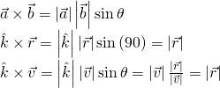
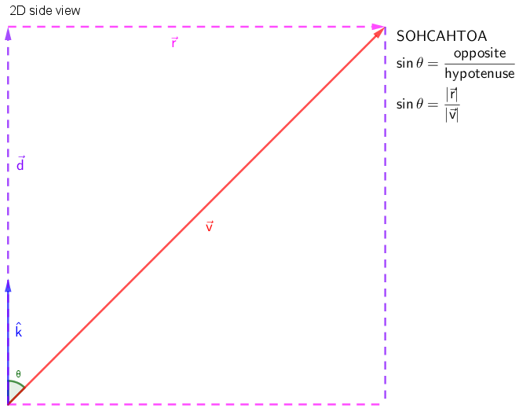

### Algebraic proof

Alternatively we can plug the values in and simplify:

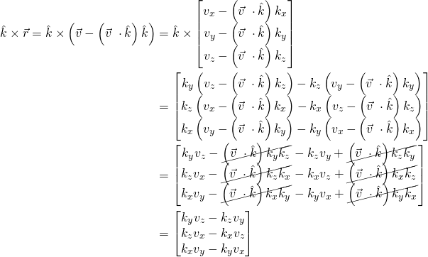

## Rotating around a circle

Now that we have two perpendicular vectors we can talk about how to use them to rotate around a circle. 

Since `cosθ` and `sinθ` can be thought of as x and y components on a unit circle we can use them to scale the two perpendicular axes to find a point on the edge of the circle.

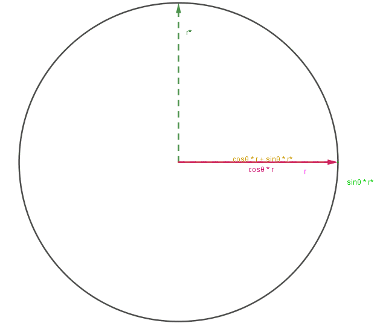

Thus, to represent this new vector, `r'`, we can use the following equation:

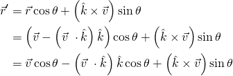

## Putting it all together

Finally, to get the end result we must add the `r'` vector to the `d` vector to give us our rotated `v` vector.

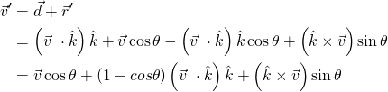

This leaves us with the final equation and what you would find [on wikipedia](https://en.wikipedia.org/wiki/Rodrigues%27_rotation_formula)!

```Lua
local function rodriguesRotation(v, k, t)
	k = k.unit;
	local cos, sin = math.cos(t), math.sin(t);
	return v*cos + (1-cos)*v:Dot(k)*k + k:Cross(v)*sin;
end
```

## Matrix form

In the previous section we had a equation that gave us a rotated vector. Occasionally we may find it useful to be able to preform this same rotation opperation, but with a matrix instead.

To start off we must realize that we need a way to represent the dot product and the cross product as matrix multiplications.

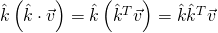

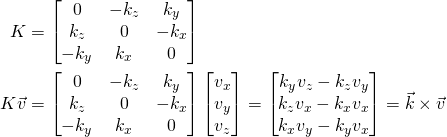

Now we can plug these into the original equation and factor out the vector we want to rotate, `v`. We'll note that we get a clear distinction between the rotation matrix `R` and `v`.

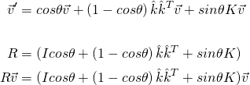

Next we can show that:

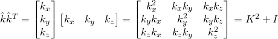
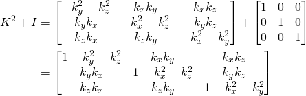

Remembering that since `k` is a unit vector it must be true that `kx^2 + ky^2 + kz^2 = 1` which can then be rearranged and used to simplify.

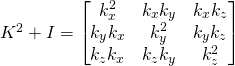

Using this revelation we can rewrite our `R` matrix.

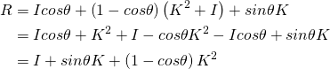

Now expand it:

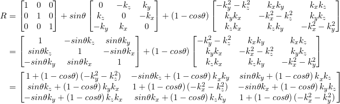

Again using the knowledge that `kx^2 + ky^2 + kz^2 = 1` we can simplify which leaves us with the final form of the matrix.

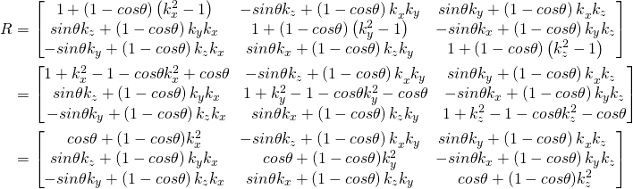

```Lua
local function rodriguesMatrix(k, t)
	-- we will use CFrame for this
	local kx, ky, kz = k.x, k.y, k.z
	local cos, sin = math.cos(t), math.sin(t);
	return CFrame.new(0, 0, 0,
		cos + (1-cos)*kx*kx, -sin*kz + (1-cos)*kx*ky, sin*ky + (1-cos)*kx*kz,
		sin*kz + (1-cos)*ky*kx, cos + (1-cos)*ky*ky, -sin*kx + (1-cos)*ky*kz,
		-sin*ky + (1-cos)*kz*kx, sin*kx + (1-cos)*kz*ky, cos + (1-cos)*kz*kz
	);
end

-- now we can re-use the same rotation:
local R = rodriguesMatrix(Vector3.new(0, 0, 1), math.pi/2); -- 90 degrees counter-clockwise around z-axis
print(R * Vector3.new(1, 0, 0)); -- 0, 1, 0
print(R * Vector3.new(0, 1, 0)); -- -1, 0, 0
```

## 2D rotation matrix

There are a number of ways to find the 2D rotation matrix, but since we have already done all the math for the matrix form we may as well use it to find out how to rotate a 2D vector.

We know that since we're only rotating x and y components the axis of rotation is `k = (0, 0, 1)`. If we plug that into the matrix and simplify we're left with the following matrix:

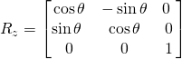

Of course all we need from this matrix to rotate a 2D vector is the square top left corner. This leaves us with our 2D rotation matrix.

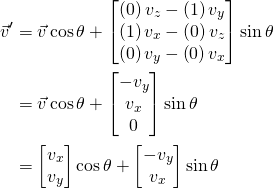

```Lua
local function rotateV2(v, t)
	local cos, sin = math.cos(t), math.sin(t);
	local x = v.x*cos - v.y*sin;
	local y = v.x*sin + v.y*cos;
	return Vector2.new(x, y);
end
```

## Euler angle rotations

We can also use the matrix form of a Rodrigues' rotation to find out how euler angle rotations work. In the same way that we focused on rotation around the z-axis in the 2D rotation matrix section we can also write out the matrices that represent the x and y axes as well.

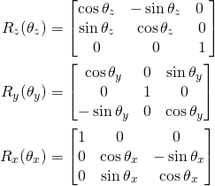

### fromEulerAnglesXYZ

Multiplying the above matrices as `Rx * Ry * Rz` we get a rotation matrix that represents a rotation applied in Z, Y, X order (this is due to vectors post multiplying).

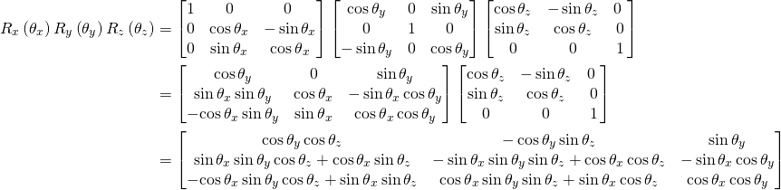

This matrix is exactly what the `CFrame.fromEulerAnglesXYZ` and `CFrame.Angles` constructors use.

```Lua
local function fromEulerAnglesXYZ(rx, ry, rz)
	local cx, sx = math.cos(rx), math.sin(rx);
	local cy, sy = math.cos(ry), math.sin(ry);
	local cz, sz = math.cos(rz), math.sin(rz);
	
	return CFrame.new(0, 0, 0,
		cy*cz, -cy*sz, sy,
		sx*sy*cz+cx*sz, -sx*sy*sz+cx*cz, -sx*cy,
		-cx*sy*cz+sx*sz, cx*sy*sz+sx*cz, cx*cy
	);
end
```

### fromEulerAnglesYXZ

Multiplying the above matrices as `Ry * Rx * Rz` we get a rotation matrix that represents a rotation applied in Z, X, Y order (this is due to vectors post multiplying).

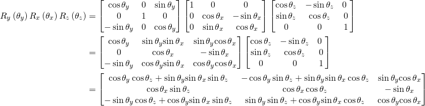

This matrix is exactly what the `CFrame.fromEulerAnglesYXZ` and `CFrame.fromOrientation` constructors use.

```Lua
local function fromEulerAnglesYXZ(rx, ry, rz)
	local cx, sx = math.cos(rx), math.sin(rx);
	local cy, sy = math.cos(ry), math.sin(ry);
	local cz, sz = math.cos(rz), math.sin(rz);
	
	return CFrame.new(0, 0, 0,
		cy*cz+sy*sx*sz, -cy*sz+sy*sx*cz, sy*cx,
		cx*sz, cx*cz, -sx,
		-sy*cz+cy*sx*sz, sy*sz+cy*sx*cz, cy*cx
	);
end
```
