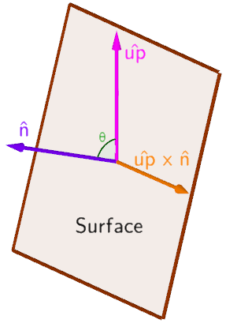

# The cross product

The cross product, sometimes called the vector product, is an operation preformed on two three-dimensional vectors which returns a third vector that is perpendicular to the other two. Mathematically the cross product is written as two vectors seperated by an `x`.

)

We can note from the above image that the order of the cross product matters since it flips the resulting vector. So how do we know which order faces which way?

## Right hand rule

By using what is called the right hand rule it is possible to figure which of the two possible directions the cross product is going in.

1. Open your right hand like you're about to shake somebody's hand.
2. Straighten your thumb so it's 90 degrees vertical from your index finger.
3. Aim your fingers (not your thumb) to be pointing in the direction of the first vector.
4. Twist your wrist such that you can curl your fingers inwards towards the second vector.

If you can successfully curl your fingers then your thumb will represent the resulting direction.

This concept can be hard to grasp without any visuals. As such it's recommended that you check out this video to get a better visualization.

[](https://www.youtube.com/watch?v=zGyfiOqiR4s)

## Calculating the cross product

The code for calculating the cross product is as follows and is equivalent to the `Vector3:Cross()` method.

```Lua
local function cross(a, b)
	return Vector3.new(
		a.y*b.z - a.z*b.y,
		a.z*b.x - a.x*b.z,
		a.x*b.y - a.y*b.x
	)
end
```

From this formula you can note that if `a` and `b` are parallel then the cross product results in a zero vector. This is because in this case there are an infinite number of vectors that fit the criteria of being perpendicular to both `a` and `b`.

## Perpendicular proof

To prove that the cross product is in fact perpendicular to both input vectors we can use the [dot product](https://github.com/EgoMoose/Articles/blob/master/Vectors/Dot%20product.md) which states that the the magnitude of `a` dot `b` is equal to `|a||b|cosθ`. Thus if the resulting cross product vector is perpendicular to both inputs (90 degrees) the dot product should be zero.

```
c = a x b

c.x = a.y*b.z - a.z*b.y
c.y = a.z*b.x - a.x*b.z
c.z = a.x*b.y - a.y*b.x

a . c = a.x*a.y*b.z - a.x*a.z*b.y + a.y*a.z*b.x - a.y*a.x*b.z + a.z*a.x*b.y - a.z*a.y*b.x
      = (a.x*a.y*b.z - a.y*a.x*b.z) + (a.y*a.z*b.x - a.z*a.y*b.x) + (a.z*a.x*b.y - a.x*a.z*b.y)
	  = 0

b . c = b.x*a.y*b.z - b.x*a.z*b.y + b.y*a.z*b.x - b.y*a.x*b.z + b.z*a.x*b.y - b.z*a.y*b.x
      = (b.x*a.y*b.z - b.z*a.y*b.x) + (b.y*a.z*b.x - b.x*a.z*b.y) + (b.z*a.x*b.y - b.y*a.x*b.z)
	  = 0
```

## Magnitude of the cross product

The magnitude of the cross product represents the area of the parallelogram that is created by the two input vectors.

)

This means the magnitude of the cross product is equivalent to `|a x b| = |a||b||sinθ|`.

One thing to take note of is that unlike the dot product's magnitude the trigonomic aspect is an absolute value. This means we cannot as easily rearrange to solve for theta since `|sinθ| = |sin(θ + π)|` thus providing the potential to get the wrong angle.

The proof for the magnitude is quite messy, but can be found below if interested.

```
|a x b|^2 = (a.y*b.z - a.z*b.y)^2 + (a.z*b.x - a.x*b.z)^2 + (a.x*b.y - a.y*b.x)^2
          = a.x^2*(b.y^2 + b.z^2) + a.y^2*(b.x^2 + b.z^2) + a.z^2*(b.x^2 + b.y^2) - 2*(a.y*a.z*b.y*b.z + a.x*a.z*b.x*b.z + a.x*a.y*b.x*b.y)

|a . b|^2 = a.x^2*b.x^2 + a.y^2*b.y^2 + a.z^2*b.z^2 + 2*(a.y*a.z*b.y*b.z + a.x*a.z*b.x*b.z + a.x*a.y*b.x*b.y)

|a x b|^2 + |a . b|^2 = (a.x^2 + a.y^2 + a.z^2)*(b.x^2 + b.y^2 + b.z^2)
|a x b|^2 + |a . b|^2 = |a|^2*|b|^2
|a x b|^2 = |a|^2*|b|^2 - |a . b|^2
|a x b|^2 = |a|^2*|b|^2 - |a|^2*|b|*cos^2(θ)
|a x b|^2 = |a|^2*|b|^2*(1 - cos^2(θ))
|a x b|^2 = |a|^2*|b|^2*sin^2(θ)
|a x b| = |a|*|b|*|sinθ| -> abosolute value of sinθ since a sqrt inner value can't be negative
```

## Example of the cross product: Rotated placement

Sometimes you may find yourself creating a studio plugin or tool where you want to place objects on a rotated surface. Without the cross product this can be a nightmare! Luckily with a little bit of application of axis-angle rotations and what we have just learned, it's easy as can be!

Every surface has a normal and we can easily find it with the `Workspace:FindPartOnRay()` method. We can cross this with the up vector, `Vector3.new(0, 1, 0)`, to give us an axis to rotate around and then use the dot product to find the angle



With these two pieces of information we can easily use the `CFrame.fromAxisAngle` constructor to properly rotate our object.


```Lua
-- local script
local mouse = game.Players.LocalPlayer:GetMouse()
local moveModel = workspace:WaitForChild("Wood Crate")
mouse.TargetFilter = moveModel
 
function placeAtMouse(dt)
	if (mouse.Target) then
		-- where we cast our ray from (shifted slightly up so the ray will hit the surface we're hovering)
		local origin = mouse.Hit.p + Vector3.new(0, 0.1, 0)
 
		-- cast our ray and get our normal, which is a unit vector
		local ray = Ray.new(origin, Vector3.new(0, -1, 0))
		local hit, pos, normal = workspace:FindPartOnRay(ray, moveModel)
 
		-- get the perpendicular vector and the angle between the two
		local cross = Vector3.new(0, 1, 0):Cross(normal)
		local theta = math.acos(Vector3.new(0, 1, 0):Dot(normal))
		
		-- make sure our axis is valid
		local axis = Vector3.new(1, 0, 0)
		if (cross.magnitude > 0) then
			axis = cross.unit
		end
 
		-- CFrame the model
		moveModel:SetPrimaryPartCFrame(
			CFrame.new(mouse.Hit.p + normal * moveModel:GetModelSize().y/2) -- position
			* CFrame.fromAxisAngle(axis, theta) -- rotation
		)
	end
end
 
-- update every frame
game:GetService("RunService").RenderStepped:connect(placeAtMouse)
```


