# Dot product

The dot product is an operation performed on two vectors in any dimension that returns a single number. It is also sometimes called the scalar product, the inner product, or rarely the projection product. The dot product is considered a way to multiply two vectors. Performing the dot product operation is simple enough, but in order to use it in code you will need a good understanding of the mathematics behind the operation. This article aims give a better understanding of the dot product so that you can use it in your games.

## Table of contents

* [Geometric definition](#geometric-definition)
* [Algebraic definition](#algebraic-definition)
* [Case study: Reflecting lasers](#case-study-reflecting-lasers)

## Geometric definition

To start off let’s have a definition for the dot product given vectors U and V.

*“The scalar projection of U onto V multiplied by the magnitude of V”*

*“The scalar projection of V onto U multiplied by the magnitude of U”*

This definition may of course leave you wondering what a scalar projection is, and more importantly how to calculate it. A scalar projection is the amount that one vector travels in another vector’s direction. So if we say that we want the projection of U onto V we want to know how much of vector U is going in the same direction as vector V and vice versa for the projection of V onto U.

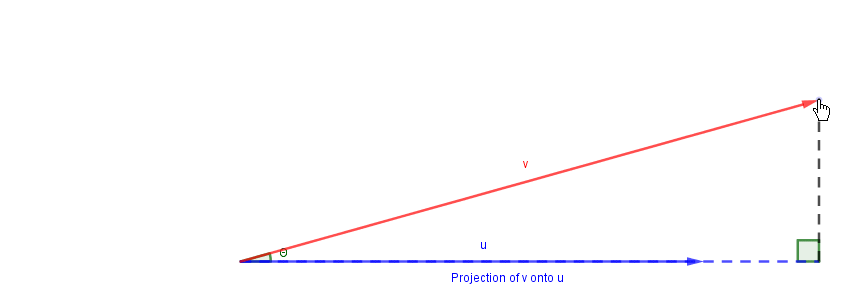

To calculate the projection we use the trigonometric functions alongside right triangles to solve for the adjacent edge.

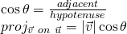


*Note that θ is the angle between vectors.*

To finish the dot product calculation we take the magnitude of the vector we’re projecting onto and multiply it by the projection. With that in mind we can start to define an equation for the dot product:


If we were to follow the same process and multiply the projection of u onto v by the magnitude of v we will find we get the same result.

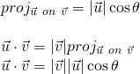

Thus, the dot product is communative meaning:


Using our geometric definition of the dot product we could write it in code as such.

```Lua
function dot(u, v, theta)
	return u.magnitude * v.magnitude * math.cos(theta);
end
```

Before we move on, there are a few important things we can take away from this definition. After some simple rearranging we can find either of the projections and the angle between the two vectors.

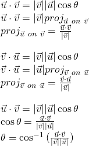

Take note that the projections are scalars and can be negative. In order to convert these projections into vectors one would have to multiply them by the unit vector of what it's being projected onto.

## Algebraic definition

In the previous section we defined both an equation and a geometric definition for the dot product. The main issue with this is that the geometric equation for the dot product requires us to know the angle between two vectors for us to be able to compute it. Lucky for us there is another way to calculate the dot product. To figure out what that is let’s review the law of cosines.

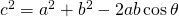

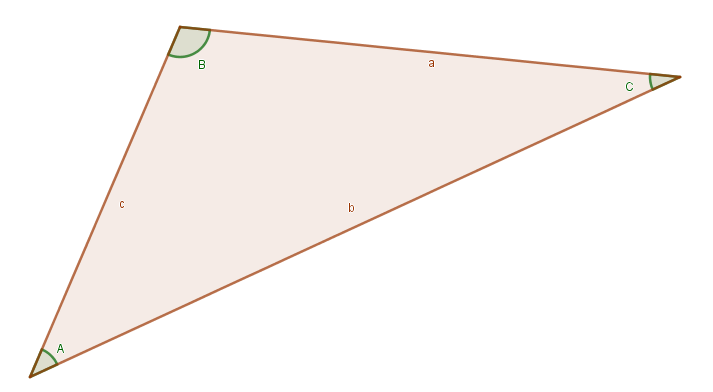

We can apply this same formula to a triangle created by two vectors.

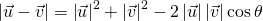

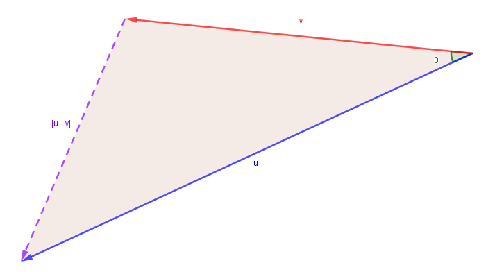

We can sub in the dot product for the final term and rearrange.

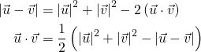

We know that the magnitude of a vector comes from the Pythagorean Theorem thus we know that the magnitude of a vector squared is equal to the sum of its components squared.

*Where i represents the components of the vector.*


Thus if we plug this in we're left with:


In code this would be:

```Lua
function dot2d(u, v)
	return u.x*v.x + u.y*v.y + u.z*v.z;
end
```

```Lua
function dot2d(u, v)
	return u.x*v.x + u.y*v.y;
end
```

The above functions would be equivalent to the `:Dot()` method that both of the vector classes have built in.

## Case study: Reflecting lasers

To finish this article off we’re going to go how we can use the dot product to create a laser beam that reflects off things in our game. To do this calculation we will need two things:

* The vector we want to reflect
* The surface normal of what we want to reflect against

Getting the first part is simple enough, but how do we get the surface normal? For the sake of this example we will use the returned normal vector from the `:FindPartOnRay()` method.

So, let’s take a look at the situation. In the image below we have the vector we want to reflect (initial laser) and the surface normal. Our goal is to calculate the reflected laser’s direction.

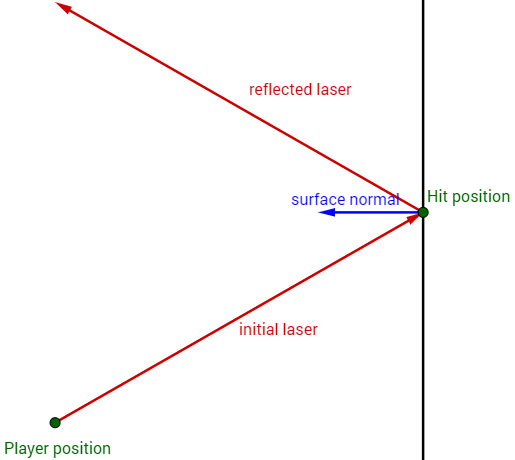

The first thing to take note of is that as we have it drawn above the vectors aren’t drawn with their tails attached to the origin which is how your computer views them. To fix that let’s redraw the above image so we can get a better visualization of our vectors (at least in a mathematical sense). We’ll also draw our reflected laser as a dotted line to signify that we don’t actually know its value, rather it’s something we’re trying to solve for.


The next step we’ll take is to get the opposite vector to the initial laser and then find its scalar projection on the surface normal.

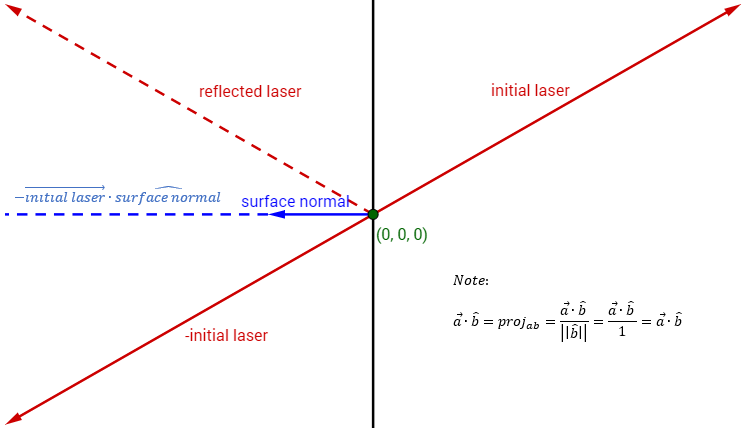

Finally, if we double that scalar projection and convert it into a vector projection we'll get a vector that's the same length and direction as the dotted blue line in the below image. If we add the initial laser to that dotted blue line you'll note we're offset to the resulting reflected laser!

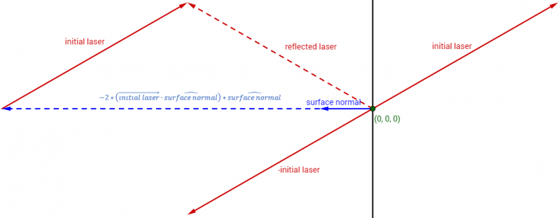

Thus, our reflection function is:

```Lua
local function reflect(vector, normal)
	return -2 * vector:Dot(normal) * normal + vector;
end
```

With that being said, this is not a lesson on creating player items/tools. There are other resources for that. As such here is a quick example of a reflecting laser gun.

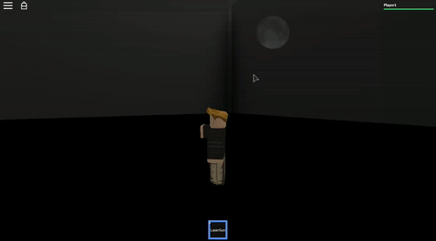

```Lua
local tool = script.Parent;
local handle = tool:WaitForChild("Handle");

local function reflect(vector, normal)
	return -2 * vector:Dot(normal) * normal + vector;
end 

local function drawray(ray, parent)
	local part = Instance.new("Part");
	part.Material = Enum.Material.Neon;
	part.Size = Vector3.new(.2, .2, ray.Direction.magnitude);
	part.CFrame = CFrame.new(ray.Origin + ray.Direction/2, ray.Origin + ray.Direction);
	part.Anchored = true;
	part.CanCollide = false;
	part.BrickColor = BrickColor.new("Bright red");
	part.Parent = parent or game.Workspace.CurrentCamera;
	return part;
end
 
local function fire(from, to, bounce)
	local bounce = bounce or 0;
	if bounce <= 5 then -- how many times can it reflect
		-- first ray is to calculate distance and normal
		local ray = Ray.new(from, (to - from).unit * 500);
		local hit, pos, normal = game.Workspace:FindPartOnRay(ray, tool.Parent);
 
		-- this is the actual ray we use and draw
		local ray2 = Ray.new(from, (pos - from));
		local part = drawray(ray2, tool);
 
		-- throw out the laser beam later
		game:GetService("Debris"):AddItem(part, 2);
 
		-- calculate the reflected ray
		local ref = reflect((pos - from), normal);
		if hit then
			local hum = hit.Parent:FindFirstChild("Humanoid");
			if hum then
				hum:TakeDamage(math.random(10, 15));
			end
			-- shoot a ray in the reflected position
			fire(pos, pos + ref, bounce + 1);
		end
	end
end
 
script.Parent.Equipped:connect(function(mouse)
	mouse.TargetFilter = game.Workspace;
	script.Parent.Activated:connect(function() 
		fire(handle.CFrame.p, mouse.Hit.p);
	end)
end)
```